## CI : Modern Computer Vision

Dans ce TP, vous allez construire une mini-application de segmentation interactive d’images à l’aide de **SAM (Segment Anything Model)**. L’objectif est de vous placer dans une situation réaliste d’ingénierie : intégrer un modèle pré-entraîné, gérer correctement l’I/O image, proposer une interface minimale mais utilisable, et produire des sorties exploitables (visualisation + mesures simples) sans entraîner de modèle.

Le TP est volontairement pragmatique et “production-minded” : vous devrez faire attention à la reproductibilité, à la performance (GPU, cache), et à la traçabilité (paramètres, sorties, captures). Le code sera en grande partie fourni, mais vous devrez compléter des zones marquées \_\_\_\_\_\_\_ pour valider votre compréhension des étapes critiques (chargement modèle, format des coordonnées, post-traitement, mesures).

*   Créer un nouveau dépôt Git et un dossier TP1/, puis publier le dépôt et transmettre le lien à l’enseignant.
*   Lancer une mini-UI accessible via SSH (port forwarding) pour segmenter une image à partir d’une bounding box.
*   Intégrer SAM en inférence sur GPU : chargement, cache, exécution en mode inference.
*   Produire une visualisation exploitable : image + bounding box + masque (overlay), et sauvegarder des résultats légers.
*   Calculer des mesures simples sur le masque (aire en pixels, bounding box du masque, périmètre approximatif) et les afficher.
*   Rédiger un rapport en Markdown au fil du TP : captures d’écran, commandes, courts commentaires et un paragraphe de réflexion (limites + pistes d’industrialisation).

### Initialisation du dépôt, réservation GPU, et lancement de la UI via SSH

Vous allez initialiser votre dépôt Git et préparer l’environnement d’exécution. Le serveur dispose déjà d’un environnement conda avec PyTorch installé : **réutilisez-le**. Point important : **réservez d’abord une GPU via SLURM avant d’installer des bibliothèques**, afin d’éviter de bloquer le nœud de connexion SLURM.

Ce TP est conçu pour tourner sur un nœud GPU réservé via SLURM (recommandé). Il est possible de le faire en local (sur votre machine), mais ce sera potentiellement très lent et/ou impossible sans GPU.

Créez un nouveau dépôt Git (sur la plateforme habituelle) et créez le dossier TP1/ avec l’arborescence minimale ci-dessous. Faites-le soit directement sur votre machine (local), soit sur le serveur (recommandé si vous développez à distance).

```bash
mkdir -p TP1/{data/images,src,outputs/overlays,outputs/logs,report}
touch TP1/requirements.txt TP1/src/app.py TP1/src/sam_utils.py TP1/src/geom_utils.py TP1/src/viz_utils.py TP1/report/report.md TP1/README.md
```

Mettez à jour votre rapport TP1/report/report.md avec :

*   le lien de votre dépôt (ou un placeholder que vous remplacerez plus tard),
*   l’endroit où vous exécutez le TP (local ou nœud GPU via SLURM),
*   l’arborescence TP1/ (un simple aperçu, pas besoin de copier toutes les commandes).

Sur le serveur, réservez une GPU via SLURM. Une fois sur le nœud GPU, activez l’environnement conda existant.

Vous ne devez **pas** installer de bibliothèques sur le nœud de connexion. Faites-le uniquement après réservation et login sur le nœud GPU.

```bash
# Exemple générique (adaptez à votre cluster) :
# salloc --gres=gpu:1 --time=01:30:00 --cpus-per-task=4 --mem=16G
# ou
# srun --gres=gpu:1 --time=01:30:00 --cpus-per-task=4 --mem=16G --pty bash

# Activez ensuite l'environnement conda déjà disponible (nom à adapter)
conda activate deeplearning

python -c "import torch; print('torch', torch.__version__); print('cuda_available', torch.cuda.is_available()); print('device_count', torch.cuda.device_count())"
```
> la commande python pour mon environnement `deeplearning` retourne:
> ```bash
> (deeplearning) ppillet@arcadia-slurm-node-2:~$ python -c "import torch; print('torch', torch.__version__); print('cuda_available', torch.cuda.is_available()); print('device_count', torch.cuda.device_count())"
> torch 2.6.0+cu124
> cuda_available True
> device_count 1
> ```
Mettez à jour votre rapport avec :

*   le nom de l’environnement conda activé,
*   une preuve que CUDA est disponible (ex : capture terminal ou une phrase avec les valeurs clés).

Installez les dépendances **sur la machine de calcul** (le nœud GPU). Remplissez TP1/requirements.txt avec les bibliothèques nécessaires au TP. Vous devez au minimum avoir : Streamlit, OpenCV, et SAM.

PyTorch est déjà installé dans l’environnement conda. N’ajoutez pas torch dans requirements.txt.

Si une installation échoue à cause du réseau, contactez l’enseignant : il pourra fournir une alternative (miroir, wheel, ou autre méthode).

```bash
# Éditez requirements.txt (au minimum)
cat > TP1/requirements.txt << 'EOF'
streamlit
opencv-python
numpy
matplotlib
# SAM v1 (Segment Anything)
git+https://github.com/facebookresearch/segment-anything.git
EOF

# Installation sur le nœud GPU (dans l'environnement conda activé)
pip install -r TP1/requirements.txt
```

Mettez à jour votre rapport avec :

*   une preuve que l’import de segment\_anything fonctionne (capture terminal ou phrase courte).

```bash
python -c "import streamlit, cv2, numpy; print('ok'); import segment_anything; print('sam_ok')"
```
> ```bash
> (deeplearning) ppillet@arcadia-slurm-node-2:~$ python -c "import streamlit, cv2, numpy; print('ok'); import segment_anything; print('sam_ok')"
> ok
> sam_ok
> ```
Préparez l’accès à la UI Streamlit via SSH. Vous devez choisir un port non utilisé par les autres étudiants (ex : 8511, 8512, 8513…). Ensuite, lancez Streamlit sur le **nœud GPU** en écoutant sur 0.0.0.0.

Distinguez bien : **(1) lancer Streamlit sur le nœud GPU** (machine de calcul), et **(2) créer le tunnel SSH depuis votre machine locale** (votre PC).

Choisissez un port “rare” et notez-le quelque part : vous en aurez besoin dans les exercices suivants.

```bash
# Sur le nœud GPU (dans le dossier de votre repo)
PORT=8513
streamlit run TP1/src/app.py --server.port $PORT --server.address 0.0.0.0
```

```bash
# Sur votre machine locale (port forwarding SSH)
ssh -L ${PORT}:localhost:${PORT} nodeX-tsp
```

Mettez à jour votre rapport avec :

*   le port choisi,
*   une capture d’écran montrant Streamlit ouvert dans le navigateur (URL visible),
*   un court commentaire : “UI accessible via SSH tunnel : oui/non”.
> UI accessible via SSH tunnel : oui.
>
> 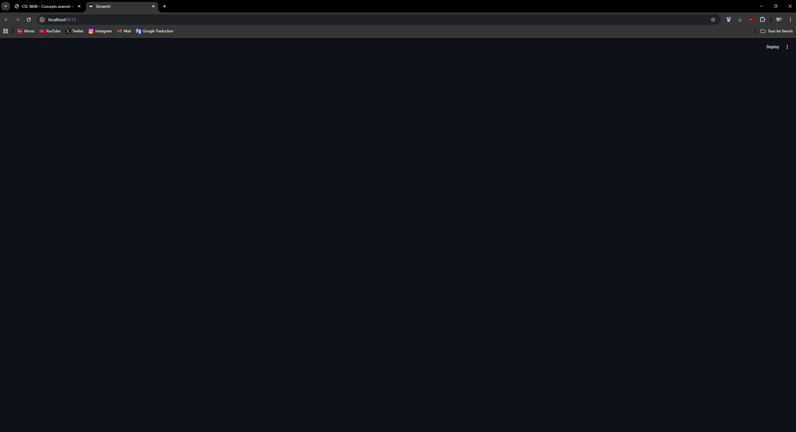
### Constituer un mini-dataset (jusqu’à 20 images)

Vous allez constituer un petit jeu de données d’images (**maximum 20**) pour tester votre application de segmentation. L’objectif est d’avoir des images suffisamment variées pour observer des comportements différents de SAM (cas faciles, cas ambigus, cas difficiles).

Les images peuvent venir du web ou de vos photos personnelles. Évitez tout contenu sensible ou identifiable si vous choisissez des photos personnelles (par simplicité et pour limiter les risques liés à l’utilisation/partage de données).

Récupérez jusqu’à **20 images** et placez-les dans TP1/data/images/. Choisissez des images “réelles” (pas uniquement des objets détourés sur fond blanc).

Votre sélection doit inclure au minimum :

*   **3 images “simples”** : un objet principal bien visible, fond peu chargé (ex : produit, outil, plante).
*   **3 images “chargées”** : plusieurs objets, fond complexe (ex : rue, magasin, cuisine, bureau).
*   **2 images “difficiles”** : occlusion, reflet, faible contraste, objet fin (ex : verre transparent, grillage, cheveux, câble).


Pour que le TP reste léger : privilégiez des images en .jpg ou .png de taille raisonnable (évitez les images 4K si possible). Ne mettez pas de fichiers trop lourds dans le dépôt ; vous utiliserez des captures d’écran dans le rapport.

Vous pouvez utiliser wget pour télécharger des images à partir d'une URL

```bash
# Vérification rapide (sur la machine où se trouve le repo)
ls -lah TP1/data/images | head

# Optionnel : afficher le nombre d’images
python -c "import pathlib; p=pathlib.Path('TP1/data/images'); print('n_images=', len([x for x in p.iterdir() if x.suffix.lower() in ['.jpg','.jpeg','.png']]))"
```

Mettez à jour votre rapport avec :

*   le nombre d’images final,
*   une liste de **5 images représentatives** (nom de fichier + 1 phrase sur pourquoi elle est intéressante),
*   au moins **2 captures d’écran** (ou vignettes) montrant un cas simple et un cas difficile.

Ne copiez pas toutes les URL. Si vous avez utilisé des images du web, vous pouvez simplement citer 1–2 sources générales ou indiquer “images récupérées via recherche web” sans détailler davantage.

> J'utilise un échantillon du dataset *Road Issues Detection Dataset* pour avoir des paysages urbains simples. https://www.kaggle.com/datasets/programmerrdai/road-issues-detection-dataset?resource=download
>
> Pour les images "simples", je suis parti regarder les annonces de voitures neuves sur lacentrale.fr et en ai récupéré 3 sur fond uni.

### Charger SAM (GPU) et préparer une inférence “bounding box → masque”

Dans cet exercice, vous allez intégrer **SAM** en inférence GPU et implémenter une fonction centrale : à partir d’une image et d’une **bounding box**, produire un **masque binaire**. Cette brique sera ensuite appelée par l’interface Streamlit.

Vous exécuterez le code sur la **machine de calcul** (nœud GPU SLURM recommandé). En local, cela peut fonctionner, mais l’inférence sera nettement plus lente, et certaines installations peuvent être problématiques.

Téléchargez les poids SAM (checkpoint) sur la machine de calcul et placez-les dans un dossier TP1/models/. Vous devez créer ce dossier et vérifier que le fichier est présent.

Ne commitez pas le checkpoint dans votre dépôt : c’est un gros fichier. Gardez-le uniquement sur la machine de calcul.

```bash
mkdir -p TP1/models
wget https://dl.fbaipublicfiles.com/segment_anything/sam_vit_h_4b8939.pth
# https://dl.fbaipublicfiles.com/segment_anything/sam_vit_h_4b8939.pth = huge
# https://dl.fbaipublicfiles.com/segment_anything/sam_vit_l_0b3195.pth = large
# https://dl.fbaipublicfiles.com/segment_anything/sam_vit_b_01ec64.pth = base (si vous avez des problèmes de performance)
mv *pth TP1/models
# Vérifiez ensuite :
ls -lah TP1/models
```

> ```bash
> (deeplearning) ppillet@arcadia-slurm-controller:~$ ls -lah TP1/models
> total 567M
> drwxrwxrwx 2 ppillet 1268 4.0K Mar 20 16:28 .
> drwxrwxrwx 7 ppillet 1268 4.0K Mar 20 16:17 ..
> -rwx------ 1 ppillet 1268 568M Mar 20 16:29 .sam_vit_h_4b8939.pth
> ```


Complétez TP1/src/sam\_utils.py pour charger SAM sur le bon device et créer un SamPredictor. Les parties \_\_\_\_\_\_\_ doivent être remplacées par du code correct.

```python
import os
import numpy as np
import torch
from segment_anything import sam_model_registry, SamPredictor


def get_device() -> str:
    """
    Retourne 'cuda' si dispo, sinon 'cpu'.
    """
    return "cuda" if _______ else "cpu"


@torch.inference_mode()
def load_sam_predictor(checkpoint_path: str, model_type: str = "vit_h") -> SamPredictor:
    """
    Charge SAM et retourne un SamPredictor prêt pour l'inférence.
    """
    if not os.path.isfile(checkpoint_path):
        raise FileNotFoundError(f"Checkpoint introuvable: {checkpoint_path}")

    device = get_device()

    sam = sam_model_registry[model_type](checkpoint=checkpoint_path)
    sam.to(device=_______)
    sam.eval()

    predictor = SamPredictor(_______)
    return predictor
```

Implémentez la fonction predict\_mask\_from\_box dans TP1/src/sam\_utils.py. Elle prend une image RGB (numpy) et une bbox (x1,y1,x2,y2) en pixels, et renvoie : **(mask\_bool, score\_float)**.

On suppose que la bbox est déjà dans le repère de l’image affichée (pixels). Plus tard, l’UI vous fournira ces coordonnées.

```python
@torch.inference_mode()
def predict_mask_from_box(
    predictor: SamPredictor,
    image_rgb: np.ndarray,
    box_xyxy: np.ndarray,
    multimask: bool = True,
):
    """
    image_rgb: (H,W,3) uint8 en RGB
    box_xyxy: (4,) -> [x1,y1,x2,y2] en pixels
    retourne: (mask_bool(H,W), score_float)
    """
    if image_rgb.ndim != 3 or image_rgb.shape[2] != 3:
        raise ValueError("image_rgb doit être (H,W,3)")
    if box_xyxy.shape != (4,):
        raise ValueError("box_xyxy doit être de shape (4,)")

    predictor.set_image(image_rgb)

    # SAM attend une box float32 de shape (1,4)
    box = box_xyxy.astype(np.float32)[None, :]

    masks, scores, _ = predictor.predict(
        point_coords=None,
        point_labels=None,
        box=_______,
        multimask_output=_______,
    )

    best_idx = int(np.argmax(scores))
    mask = masks[best_idx].astype(bool)
    score = float(scores[best_idx])
    return mask, score
```

Testez rapidement votre fonction avec une image de TP1/data/images/ et une bbox “à la main” (valeurs numériques), sur la machine de calcul. L’objectif est juste de vérifier que :

*   le modèle se charge sur GPU (si dispo),
*   la fonction renvoie bien un masque de taille (H,W),
*   le score est un float raisonnable.

```python
# TP1/src/quick_test_sam.py (à créer) ou exécuter dans un python interactif
import numpy as np
import cv2
from pathlib import Path
from sam_utils import load_sam_predictor, predict_mask_from_box

img_path = next(Path("TP1/data/images").glob("*.jpg"))  # adaptez si besoin
bgr = cv2.imread(str(img_path), cv2.IMREAD_COLOR)
rgb = cv2.cvtColor(bgr, cv2.COLOR_BGR2RGB)

ckpt = "TP1/models/_______"  # nom du fichier .pth
pred = load_sam_predictor(ckpt, model_type="vit_h") # Attention, ou vit_l ou vit_b

# bbox "à la main" (exemple) : adaptez à votre image
box = np.array([50, 50, 250, 250], dtype=np.int32)

mask, score = predict_mask_from_box(pred, rgb, box, multimask=True)
print("img", rgb.shape, "mask", mask.shape, "score", score, "mask_sum", mask.sum())
```

Mettez à jour votre rapport avec :

*   le modèle choisi (vit\_h par exemple) et le nom du checkpoint utilisé (sans l’ajouter au dépôt),
*   une capture du test rapide (sortie console) montrant la shape de l’image, du masque, et le score,
*   un court commentaire (3–5 lignes) sur un premier constat : “ça marche / c’est lent / limites observées”.

> Le modèle vit\_h est utilisé avec le checkpoint sam\_vit\_h\_4b8939.pth. 
> 
> En lancant la commande de test rapide, j’obtiens la sortie suivante :
> ```bash 
> (deeplearning) ppillet@arcadia-slurm-node-2:~$ python TP1/src/quick_test_sam.py 
> Device utilisé pour SAM: cuda
> img (320, 320, 3) mask (320, 320) score 0.8160543441772461 mask_sum 8555
> ``` 
> Cela indique que SAM est correctement chargé et que la fonction de prédiction fonctionne. Cependant, l’inférence peut être lente sur CPU, donc il est recommandé d’utiliser une GPU pour de meilleures performances.

### Mesures et visualisation : overlay + métriques (aire, bbox, périmètre)

Vous allez maintenant produire des sorties “exploitables” : une visualisation claire (image + bbox + masque en overlay) et des métriques simples calculées à partir du masque. Ces éléments seront affichés dans l’UI et sauvegardés sous forme de fichiers légers.

Objectif ingénierie : séparer proprement les responsabilités (géométrie vs visualisation) et éviter les dépendances inutiles. Les fonctions de cet exercice devront être appelées par l’UI à l’exercice suivant.

Complétez TP1/src/geom\_utils.py pour calculer : **(1) aire en pixels**, **(2) bbox du masque**, **(3) périmètre approximatif**. Remplacez uniquement les \_\_\_\_\_\_\_.

```python
import numpy as np
import cv2


def mask_area(mask: np.ndarray) -> int:
    """
    Aire en pixels (nombre de pixels True).
    """
    return int(_______)


def mask_bbox(mask: np.ndarray):
    """
    BBox serrée du masque : (x1, y1, x2, y2).
    Si masque vide, retourner None.
    """
    if mask is None or mask.size == 0 or not mask.any():
        return None

    ys, xs = np.where(mask)
    x1, x2 = int(xs.min()), int(xs.max())
    y1, y2 = int(ys.min()), int(ys.max())
    return x1, y1, x2, y2


def mask_perimeter(mask: np.ndarray) -> float:
    """
    Périmètre approximatif via extraction de contours OpenCV.
    Si masque vide, retourner 0.0.
    """
    if mask is None or mask.size == 0 or not mask.any():
        return 0.0

    m = (mask.astype(np.uint8) * 255)
    contours, _ = cv2.findContours(m, cv2.RETR_EXTERNAL, cv2.CHAIN_APPROX_SIMPLE)
    per = float(sum(cv2.arcLength(c, closed=True) for c in _______))
    return per
```

Complétez TP1/src/viz\_utils.py pour générer un overlay lisible. La fonction doit :

*   prendre une image RGB (uint8), un masque booléen, et une bbox,
*   dessiner la bbox,
*   superposer le masque avec transparence (alpha),
*   retourner une image RGB (uint8).

```python
import numpy as np
import cv2


def render_overlay(
    image_rgb: np.ndarray,
    mask: np.ndarray,
    box_xyxy: np.ndarray,
    alpha: float = 0.5,
):
    """
    Retourne une image RGB uint8 avec :
    - bbox dessinée
    - masque superposé (alpha blending)
    """
    out = image_rgb.copy()

    # 1) Dessiner bbox (en RGB, mais OpenCV dessine en BGR : on dessine sur une version BGR)
    bgr = cv2.cvtColor(out, cv2.COLOR_RGB2BGR)
    x1, y1, x2, y2 = [int(v) for v in box_xyxy.tolist()]
    cv2.rectangle(bgr, (x1, y1), (x2, y2), color=(0, 255, 0), thickness=2)
    out = cv2.cvtColor(bgr, cv2.COLOR_BGR2RGB)

    # 2) Alpha blending du masque (utiliser une couleur fixe, par ex. rouge)
    if mask is not None and mask.any():
        overlay = out.copy()
        overlay[mask] = (255, 0, 0)  # RGB rouge
        out = (_______ * overlay + (1.0 - _______) * out).astype(np.uint8)

    return out
```

Faites un test rapide (hors UI) : chargez une image, définissez une bbox “à la main”, exécutez SAM, calculez les métriques, générez l’overlay, puis sauvegardez-le dans TP1/outputs/overlays/.

```python
# TP1/src/quick_test_overlay.py (à créer) ou exécuter dans un python interactif
import numpy as np
import cv2
from pathlib import Path

from sam_utils import load_sam_predictor, predict_mask_from_box
from geom_utils import mask_area, mask_bbox, mask_perimeter
from viz_utils import render_overlay

img_path = next(Path("TP1/data/images").glob("*.jpg"))  # adaptez si besoin
bgr = cv2.imread(str(img_path), cv2.IMREAD_COLOR)
rgb = cv2.cvtColor(bgr, cv2.COLOR_BGR2RGB)

ckpt = "TP1/models/_______"
pred = load_sam_predictor(ckpt, model_type="vit_h")

box = np.array([50, 50, 250, 250], dtype=np.int32)  # adaptez
mask, score = predict_mask_from_box(pred, rgb, box, multimask=True)

m_area = mask_area(mask)
m_bbox = mask_bbox(mask)
m_per = mask_perimeter(mask)

overlay = render_overlay(rgb, mask, box, alpha=0.5)

out_dir = Path("TP1/outputs/overlays")
out_dir.mkdir(parents=True, exist_ok=True)
out_path = out_dir / f"overlay_{img_path.stem}.png"

# Sauvegarde via OpenCV (BGR)
cv2.imwrite(str(out_path), cv2.cvtColor(overlay, cv2.COLOR_RGB2BGR))

print("score", score, "area", m_area, "bbox", m_bbox, "perimeter", m_per)
print("saved:", out_path)
```

Mettez à jour votre rapport avec :

*   une capture d’écran (ou vignette) d’un overlay produit,
*   un mini-tableau (3 lignes) récapitulant **image** → **score** → **aire** → **périmètre** pour 3 images,
*   un commentaire bref (5–8 lignes) : dans quels cas l’overlay aide à “debugger” le modèle/prompt ?


> 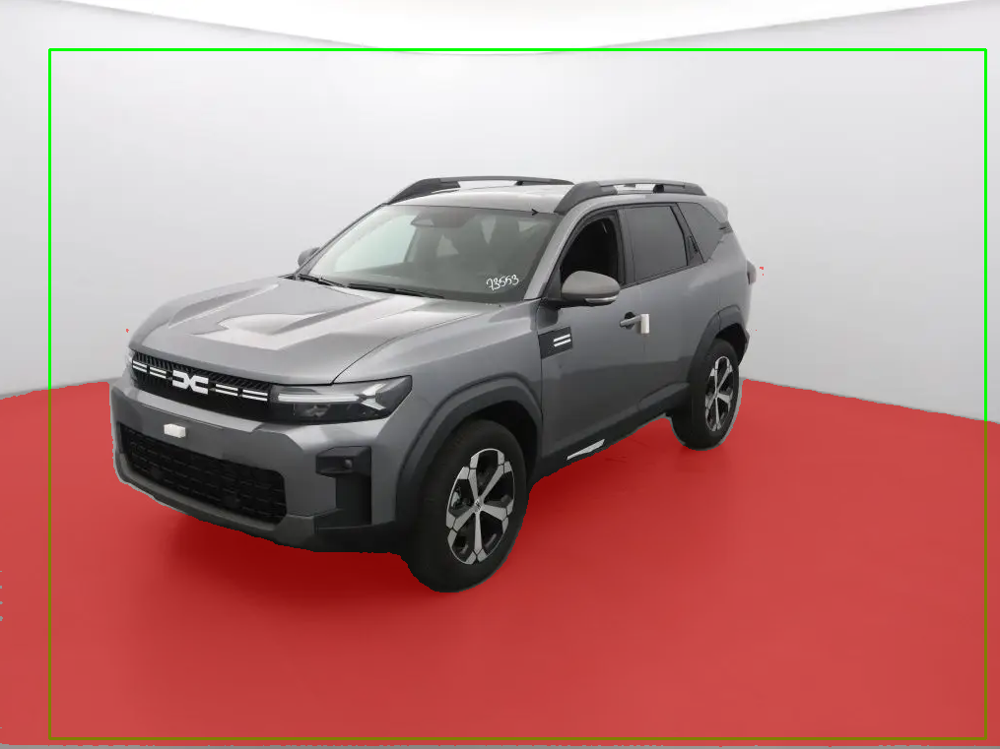
> 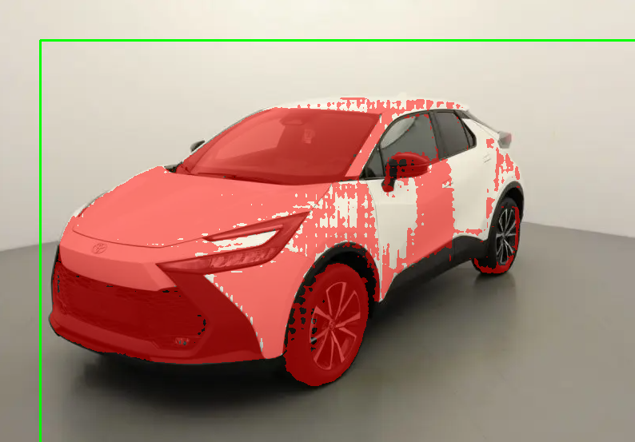
> 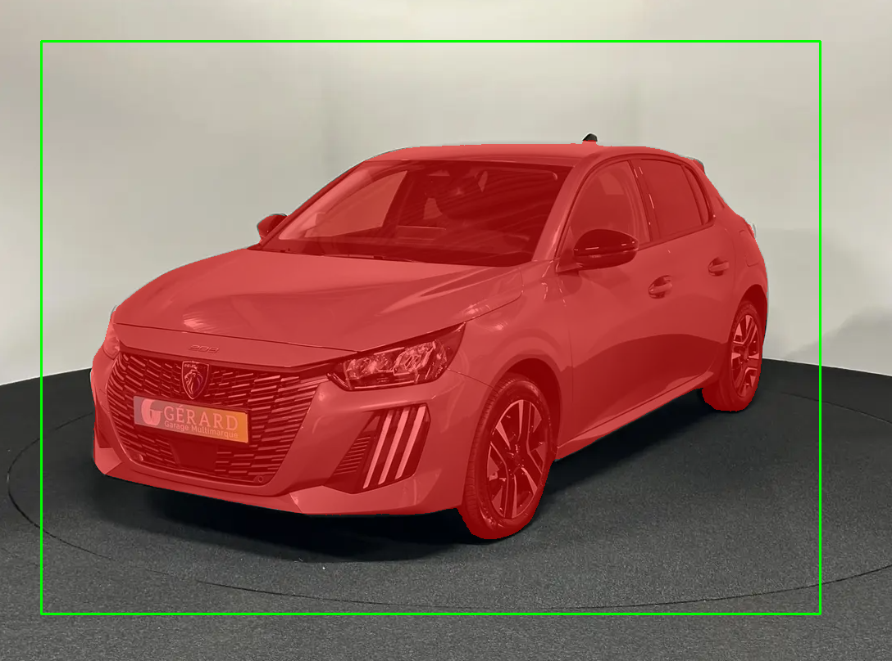
> 
> | image | score | area | perimeter |
> | --- | --- | --- | --- |
> | overlay_dacia_bigster_lacentrale | 0.9635022878646851 | 285201 | 3142.4204758405685 |
> | overlay_toyota_chr2_lacentrale | 0.9006046056747437 | 109518 | 4565.673551440239 |
> | overlay_peugeot_208_lacentrale | 1.0004583597183228 | 285863 | 2367.6824491024017 |


### Mini-UI Streamlit : sélection d’image, saisie de bbox, segmentation, affichage et sauvegarde

Vous allez maintenant assembler les briques précédentes dans une mini-UI Streamlit. L’application doit permettre : sélectionner une image, définir une bounding box, lancer la segmentation, visualiser le résultat (overlay + métriques), et sauvegarder un overlay léger.

Pour rester simple et robuste, on vous demande une saisie de bbox via **4 sliders** (x1, y1, x2, y2). Ce n’est pas le plus ergonomique, mais cela évite des dépendances UI supplémentaires et fonctionne bien via SSH.

Complétez TP1/src/app.py pour :

*   charger et cacher le predictor SAM (chargé une seule fois),
*   lister les images disponibles dans TP1/data/images/,
*   afficher l’image sélectionnée,
*   proposer 4 sliders pour la bbox, bornés par la taille de l’image,
*   lancer la segmentation au clic sur un bouton,
*   afficher overlay + métriques,
*   permettre la sauvegarde d’un overlay dans TP1/outputs/overlays/.

```python
import time
from pathlib import Path

import cv2
import numpy as np
import streamlit as st

from sam_utils import load_sam_predictor, predict_mask_from_box
from geom_utils import mask_area, mask_bbox, mask_perimeter
from viz_utils import render_overlay


DATA_DIR = Path("TP1/data/images")
OUT_DIR = Path("TP1/outputs/overlays")
CKPT_PATH = "TP1/models/_______"   # à adapter
MODEL_TYPE = "vit_h"


def load_image_rgb(path: Path) -> np.ndarray:
    bgr = cv2.imread(str(path), cv2.IMREAD_COLOR)
    if bgr is None:
        raise ValueError(f"Image illisible: {path}")
    rgb = cv2.cvtColor(bgr, cv2.COLOR_BGR2RGB)
    return rgb


@st.cache_resource
def get_predictor():
    # Chargement unique : important pour éviter de recharger SAM à chaque interaction UI
    return load_sam_predictor(_______, model_type=_______)


st.set_page_config(page_title="TP1 - SAM Segmentation", layout="wide")
st.title("TP1 — Segmentation interactive (SAM)")

# 1) Liste d'images
imgs = sorted([p for p in DATA_DIR.iterdir() if p.suffix.lower() in [".jpg", ".jpeg", ".png"]])
if len(imgs) == 0:
    st.error("Aucune image trouvée dans TP1/data/images/")
    st.stop()

img_name = st.selectbox("Choisir une image", [p.name for p in imgs])
img_path = DATA_DIR / img_name
img = load_image_rgb(img_path)
H, W = img.shape[:2]

# 2) Affichage image
st.image(img, caption=f"{img_name} ({W}x{H})", use_container_width=True)

# 3) Sliders bbox (bornés)
st.subheader("Bounding box (pixels)")
col1, col2, col3, col4 = st.columns(4)

with col1:
    x1 = st.slider("x1", 0, W - 1, 0)
with col2:
    y1 = st.slider("y1", 0, H - 1, 0)
with col3:
    x2 = st.slider("x2", 0, W - 1, W - 1)
with col4:
    y2 = st.slider("y2", 0, H - 1, H - 1)

# Normaliser bbox (x1<x2, y1<y2)
x_min, x_max = (x1, x2) if x1 < x2 else (x2, x1)
y_min, y_max = (y1, y2) if y1 < y2 else (y2, y1)
box = np.array([x_min, y_min, x_max, y_max], dtype=np.int32)

# 4) Segmentation
do_segment = st.button("Segmenter")
if do_segment:
    predictor = get_predictor()

    t0 = time.time()
    mask, score = predict_mask_from_box(predictor, img, box, multimask=True)
    dt = (time.time() - t0) * 1000.0

    overlay = render_overlay(img, mask, box, alpha=0.5)

    m_area = mask_area(mask)
    m_bbox = mask_bbox(mask)
    m_per = mask_perimeter(mask)

    st.subheader("Résultat")
    st.image(overlay, caption=f"score={score:.3f} | time={dt:.1f} ms", use_container_width=True)

    st.write({
        "score": float(score),
        "time_ms": float(dt),
        "area_px": int(m_area),
        "mask_bbox": m_bbox,
        "perimeter": float(m_per),
    })

    # 5) Sauvegarde overlay
    save = st.button("Sauvegarder overlay")
    if save:
        OUT_DIR.mkdir(parents=True, exist_ok=True)
        out_path = OUT_DIR / f"overlay_{img_path.stem}.png"
        cv2.imwrite(str(out_path), cv2.cvtColor(overlay, cv2.COLOR_RGB2BGR))
        st.success(f"Sauvegardé: {out_path}")
```

Lancez l’application Streamlit sur la machine de calcul, puis accédez-y depuis votre navigateur via SSH port forwarding. Testez sur au moins **3 images** avec des bboxes différentes.

```bash
# Sur la machine de calcul
PORT=8513
streamlit run TP1/src/app.py --server.port $PORT --server.address 0.0.0.0
```

Si Streamlit est déjà lancé, ne relancez pas sur le même port. Utilisez un nouveau port ou stoppez proprement l’ancien process.

Améliorez l’expérience utilisateur en affichant **en live** la bounding box sur l’image **avant** de lancer la segmentation. L’objectif est que l’utilisateur voie immédiatement la zone qui sera segmentée.

On ne vous demande pas de rendre la bbox “cliquable” à la souris : une prévisualisation avec les sliders suffit.

```python
# Dans TP1/src/app.py, après le calcul de `box`
# Ajouter une prévisualisation bbox-only

def draw_box_preview(image_rgb: np.ndarray, box_xyxy: np.ndarray) -> np.ndarray:
    preview = image_rgb.copy()
    bgr = cv2.cvtColor(preview, cv2.COLOR_RGB2BGR)
    x1, y1, x2, y2 = [int(v) for v in box_xyxy.tolist()]
    cv2.rectangle(bgr, (x1, y1), (x2, y2), color=(0, 255, 0), thickness=2)
    preview = cv2.cvtColor(bgr, cv2.COLOR_BGR2RGB)
    return preview

preview = draw_box_preview(img, box)
st.image(preview, caption="Prévisualisation : bbox (avant segmentation)", use_container_width=True)

# Bonus simple : avertissement bbox très petite
if (x_max - x_min) < _______ or (y_max - y_min) < _______:
    st.warning("BBox très petite : essayez une bbox plus large.")
```

Mettez à jour votre rapport avec :

*   2–3 captures d’écran de l’UI montrant des résultats (un cas simple et un cas difficile),
*   un tableau (ou liste) de 3 tests : image + bbox (valeurs) + score + aire + temps ms,
*   un court paragraphe “debug” : qu’est-ce qui change quand vous agrandissez/rétrécissez la bbox ?

> 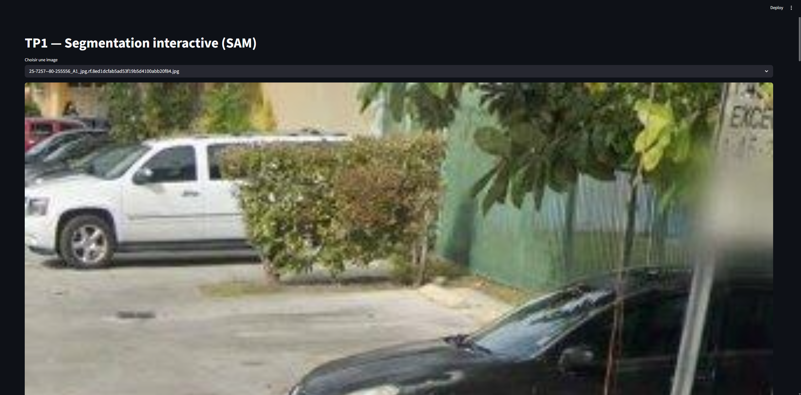
> 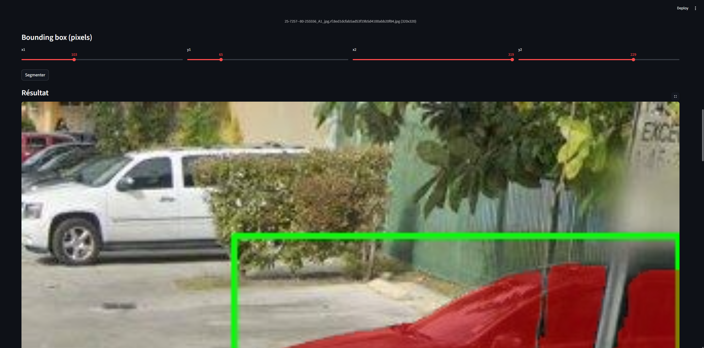
> 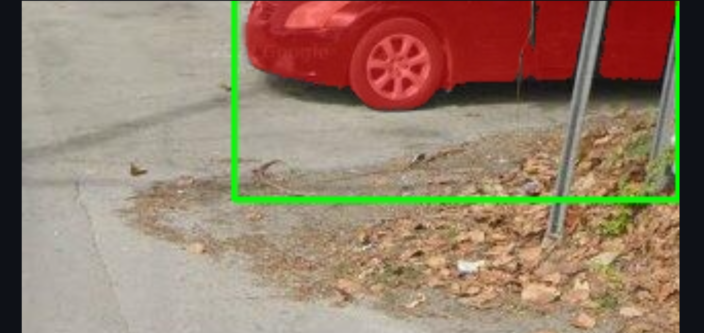
> 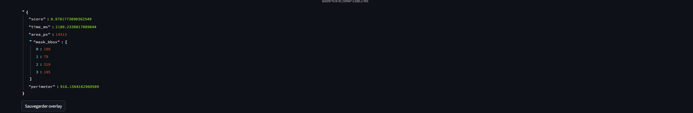
> 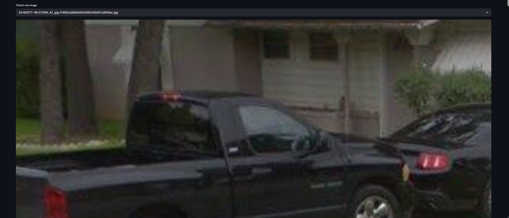
> 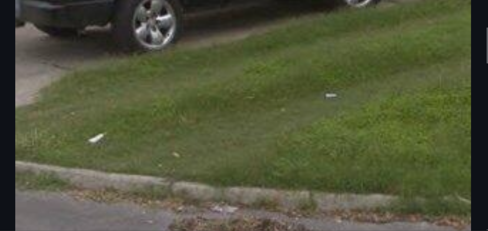
> 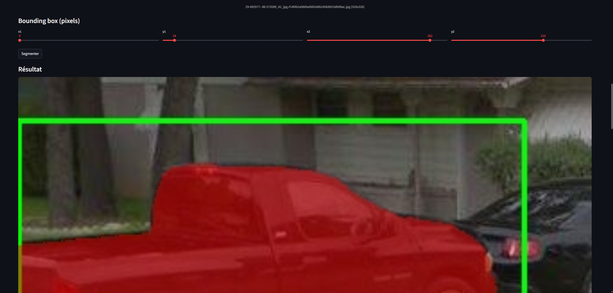
> 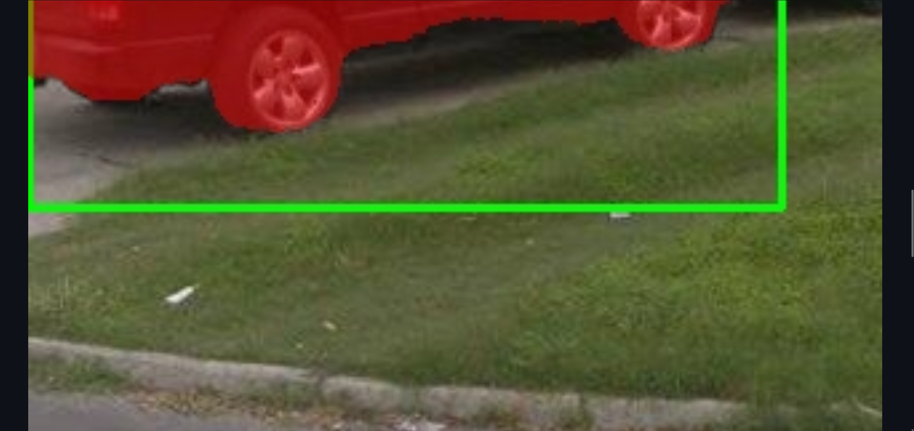
> 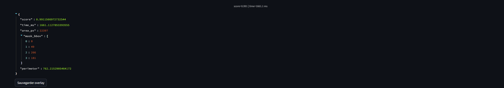
>
> | image | bbox (x1,y1,x2,y2) | score | area | time_ms |
> | --- | --- | --- | --- | --- |
> | 25-7257--80-255556_A1_jpg.rf.8ed1dcfab5ad53f19b5d4100abb20f84.jpg | (109,79,319,185) | 0.978 | 14313 | 1662.5 |
> | dacia_bigster_lacentrale.jpg | (114,179,765,597) | 0.964 | 285201 | 1657.7 |
> | 29-492977--98-573599_A2_jpg.rf.4fdb2a960befd02d4b245b9015db99ac.jpg | (0,49,266,181) | 0.991 | 22397 | 1661.1 |
>
> En agrandissant la bbox, le score de SAM peut augmenter car il a plus de contexte pour identifier l’objet. Cependant, si la bbox devient trop grande, elle peut inclure des éléments de fond ou d’autres objets, ce qui peut réduire la précision du masque et faire baisser le score. À l’inverse, une bbox trop petite peut ne pas couvrir suffisamment l’objet, ce qui rend la segmentation difficile et peut également réduire le score. Il est donc important de trouver un équilibre dans la taille de la bbox pour obtenir les meilleurs résultats de segmentation. 

### Affiner la sélection de l'objet : points FG/BG + choix du masque (multimask)

Avec une simple bounding box, SAM peut produire un masque “plausible” mais pas forcément celui de l’objet que vous visez (cas typique : plusieurs objets dans la bbox, fond complexe, objet fin). Dans cet exercice, vous allez ajouter deux mécanismes simples et très efficaces pour mieux contrôler l’objet segmenté :

*   **Points de guidage** : points _foreground_ (FG) et _background_ (BG) en plus de la bbox.
*   **Multimask + sélection** : SAM peut produire plusieurs masques candidats ; vous permettrez à l’utilisateur de choisir.

Complétez TP1/src/sam\_utils.py en ajoutant une fonction qui supporte **bbox + points FG/BG** et qui renvoie **tous les masques candidats** (multimask) + leurs scores. Remplacez uniquement les \_\_\_\_\_\_\_.

Format attendu par SAM : point\_coords : array float32 de shape (N,2) avec coordonnées pixels (x,y). point\_labels : array int64 de shape (N,) avec 1 pour FG et 0 pour BG.

```python
import numpy as np
import torch
from segment_anything import SamPredictor

@torch.inference_mode()
def predict_masks_from_box_and_points(
    predictor: SamPredictor,
    image_rgb: np.ndarray,
    box_xyxy: np.ndarray,
    point_coords: np.ndarray | None,
    point_labels: np.ndarray | None,
    multimask: bool = True,
):
    """
    Retourne (masks, scores) où :
      - masks : (K, H, W) bool
      - scores : (K,) float
    """
    predictor.set_image(image_rgb)

    box = box_xyxy.astype(np.float32)[None, :]

    if point_coords is not None:
        pc = point_coords.astype(np.float32)
        pl = point_labels.astype(np.int64)
    else:
        pc, pl = None, None

    masks, scores, _ = predictor.predict(
        point_coords=_______,
        point_labels=_______,
        box=box,
        multimask_output=_______,
    )

    return masks.astype(bool), scores.astype(float)
```

Dans TP1/src/app.py, vous allez intégrer les points FG/BG et la sélection multimask **sans casser** le flux actuel (sélection d’image → sliders bbox → prévisualisation → bouton Segmenter → affichage overlay). Pour éviter les ambiguïtés, suivez l’ordre ci-dessous et insérez le code **aux endroits indiqués**.

**Étape 1 — Imports** : en haut de TP1/src/app.py, ajoutez l’import de la nouvelle fonction predict\_masks\_from\_box\_and\_points.

```python
# Dans TP1/src/app.py (en haut, avec les autres imports)
from sam_utils import predict_masks_from_box_and_points
```

**Étape 2 — Session state** : juste après st.title(...) (début de l’UI), initialisez deux clés dans st.session\_state : points et last\_pred.

```python
# Dans TP1/src/app.py, juste après st.title(...)
if "points" not in st.session_state:
    st.session_state["points"] = []  # liste de tuples (x, y, label) label: 1=FG, 0=BG

if "last_pred" not in st.session_state:
    st.session_state["last_pred"] = None  # dict ou None
```

**Étape 3 — Bloc UI “Guidage points”** : après le bloc des sliders bbox (donc après la construction de box = np.array(\[...\])), ajoutez une section UI pour : (a) ajouter un point, (b) réinitialiser les points, (c) afficher la liste des points courants.

```python
# Dans TP1/src/app.py, juste après la construction de `box`

st.subheader("Guidage (optionnel) : points FG/BG")

# UI de saisie d'un point
c1, c2, c3 = st.columns(3)
with c1:
    px = st.slider("point x", 0, W - 1, int(W * 0.5))
with c2:
    py = st.slider("point y", 0, H - 1, int(H * 0.5))
with c3:
    ptype = st.selectbox("type", ["FG (objet)", "BG (fond)"])

# Boutons
if st.button("Ajouter point"):
    label = 1 if ptype.startswith("FG") else 0
    st.session_state["points"].append((int(px), int(py), int(label)))

if st.button("Réinitialiser points"):
    st.session_state["points"] = []

# Affichage de l'état courant (utile pour debug)
st.write({
    "n_points": len(st.session_state["points"]),
    "points": st.session_state["points"],
})
```

**Étape 4 — Prévisualisation bbox + points** : remplacez (ou complétez) la prévisualisation existante de bbox par une prévisualisation qui dessine **bbox + points**. À intégrer au même endroit que votre preview bbox actuel (avant d’appuyer sur “Segmenter”).

```python
# Dans TP1/src/app.py, à l'endroit où vous affichez déjà la prévisualisation bbox

def draw_preview(image_rgb: np.ndarray, box_xyxy: np.ndarray, points):
    preview = image_rgb.copy()
    bgr = cv2.cvtColor(preview, cv2.COLOR_RGB2BGR)

    x1, y1, x2, y2 = [int(v) for v in box_xyxy.tolist()]
    cv2.rectangle(bgr, (x1, y1), (x2, y2), color=(0, 255, 0), thickness=2)

    for (x, y, lab) in points:
        # FG = vert, BG = rouge
        color = (0, 255, 0) if lab == 1 else (0, 0, 255)
        cv2.circle(bgr, (int(x), int(y)), radius=6, color=color, thickness=-1)

    return cv2.cvtColor(bgr, cv2.COLOR_BGR2RGB)

preview = draw_preview(img, box, st.session_state["points"])
st.image(preview, caption="Prévisualisation : bbox + points (avant segmentation)", use_container_width=True)
```

**Étape 5 — Bouton de segmentation** : dans le bloc où vous aviez if do\_segment: (ou votre bouton “Segmenter”), remplacez l’appel predict\_mask\_from\_box par un appel à predict\_masks\_from\_box\_and\_points en remplaçant tout le code dans le if, puis stockez les résultats dans st.session\_state\["last\_pred"\].

```python
# Dans TP1/src/app.py, remplacer l'intérieur du bloc du bouton de segmentation

predictor = get_predictor()

pts = st.session_state["points"]
if len(pts) > 0:
    point_coords = np.array([(x, y) for (x, y, _) in pts], dtype=np.float32)
    point_labels = np.array([lab for (_, _, lab) in pts], dtype=np.int64)
else:
    point_coords, point_labels = None, None

t0 = time.time()
masks, scores = predict_masks_from_box_and_points(
    predictor=predictor,
    image_rgb=img,
    box_xyxy=box,
    point_coords=point_coords,
    point_labels=point_labels,
    multimask=True,
)
dt = (time.time() - t0) * 1000.0

st.session_state["last_pred"] = {
    "img_name": img_name,
    "box": box.copy(),
    "points": list(pts),
    "masks": masks,
    "scores": scores,
    "time_ms": float(dt),
}
```

**Étape 6 — Sélection du masque candidat + affichage** : juste après le bloc de segmentation (ou en fin de page), ajoutez un bloc qui :

*   lit st.session\_state\["last\_pred"\],
*   si la prédiction correspond à l’image courante, propose un selectbox d’index,
*   affiche l’overlay et les métriques pour le masque sélectionné,
*   permet la sauvegarde de l’overlay (comme avant).

```python
# Dans TP1/src/app.py, après le bloc de segmentation (en dehors du if du bouton)

lp = st.session_state["last_pred"]
if lp is not None and lp["img_name"] == img_name:
    masks = lp["masks"]
    scores = lp["scores"]

    st.subheader("Choix du masque candidat (multimask)")
    st.write({"scores": [float(s) for s in scores.tolist()], "time_ms": lp.get("time_ms")})

    default_idx = int(np.argmax(scores))
    idx = st.selectbox("index du masque", list(range(len(scores))), index=default_idx)

    mask = masks[int(idx)].astype(bool)
    overlay = render_overlay(img, mask, box, alpha=0.5)

    # métriques sur le masque choisi
    m_area = mask_area(mask)
    m_bbox = mask_bbox(mask)
    m_per = mask_perimeter(mask)

    st.image(overlay, caption=f"mask_idx={idx} | score={float(scores[idx]):.3f}", use_container_width=True)
    st.write({
        "mask_idx": int(idx),
        "score": float(scores[idx]),
        "area_px": int(m_area),
        "mask_bbox": m_bbox,
        "perimeter": float(m_per),
    })

    if st.button("Sauvegarder overlay (masque sélectionné)"):
        OUT_DIR.mkdir(parents=True, exist_ok=True)
        out_path = OUT_DIR / f"overlay_{img_path.stem}_m{int(idx)}.png"
        cv2.imwrite(str(out_path), cv2.cvtColor(overlay, cv2.COLOR_RGB2BGR))
        st.success(f"Sauvegardé: {out_path}")
```

Testez sur au moins **2 images difficiles** où la bbox contient plusieurs éléments (ou un fond complexe). Pour chaque image, faites :

*   un essai “bbox seule” (sans points) ; notez si le masque correspond à l’objet voulu,
*   un essai “bbox + 1 point FG” (sur l’objet voulu),
*   si nécessaire, ajoutez **1 point BG** sur une zone à exclure (fond ou autre objet),
*   comparez les **masques candidats** (multimask) et choisissez le meilleur via l’UI.

Commencez souvent par 1 point FG “au centre” de l’objet, puis ajoutez 1 point BG sur l’erreur la plus gênante.

Mettez à jour votre rapport avec :

*   une comparaison “avant/après” sur **2 images** (captures UI) : bbox seule vs bbox + points,
*   pour chaque cas : la liste des points utilisés (coordonnées + FG/BG) et le masque index choisi,
*   un court paragraphe (6–10 lignes) : dans quels cas les points BG sont indispensables ? quels cas restent difficiles ?

> ## Image 1 : fond complexe avec plusieurs objets sans points
> 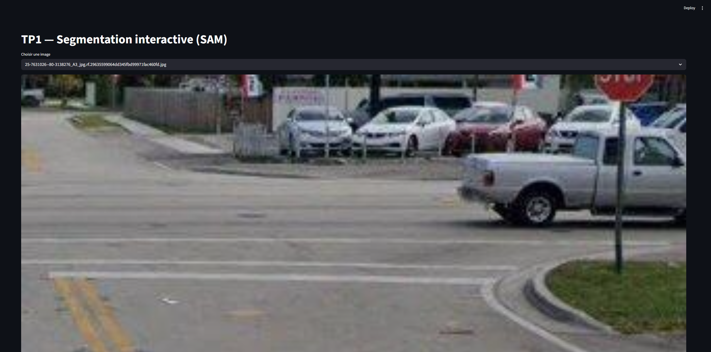
> 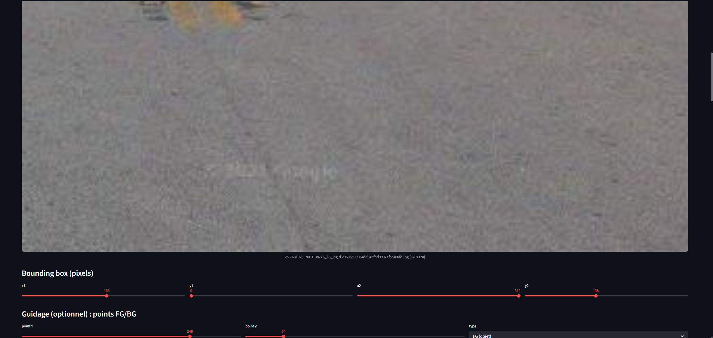
> 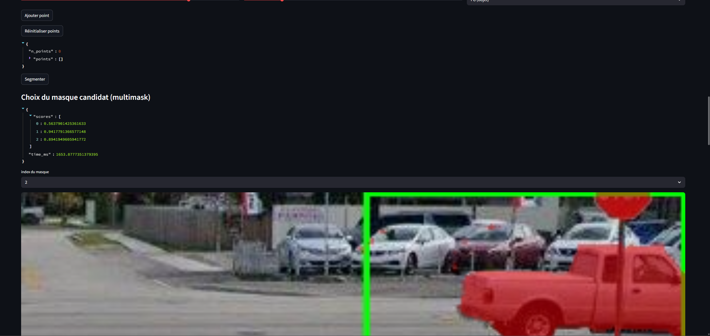
> 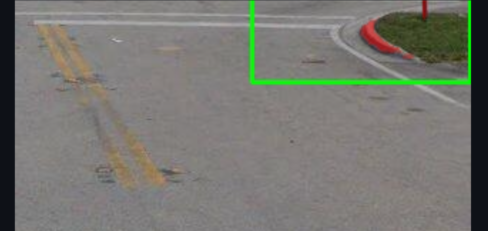
> 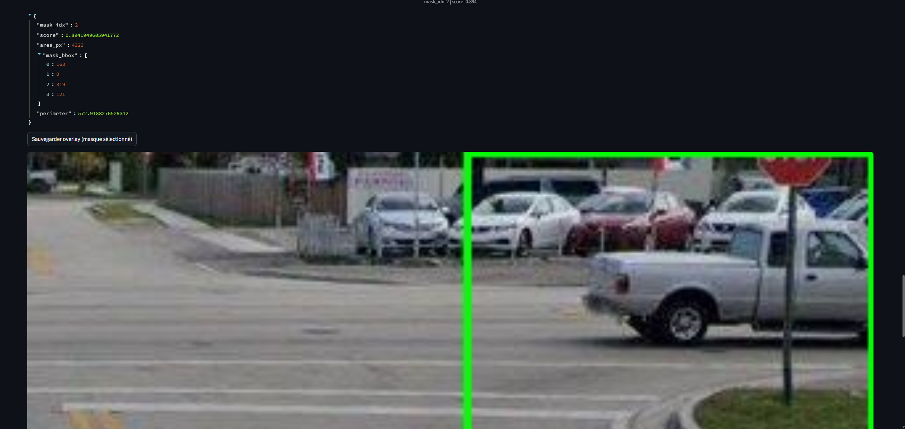
> On trouve la voiture, mais le panneau devant est inclus dans le masque, ce qui n’est pas idéal.
> ## Image 2 : fond complexe avec plusieurs objets, ajout d’un point FG
> 
> 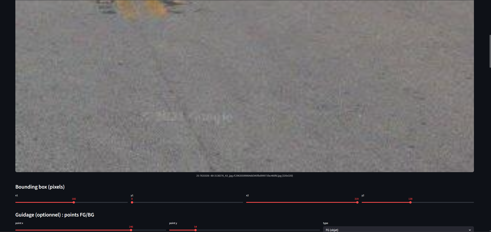
> 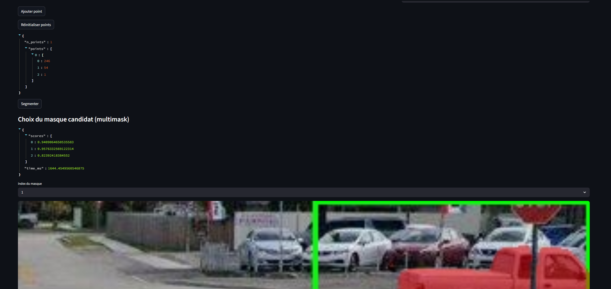
> 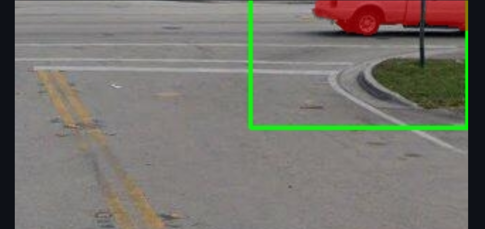
> 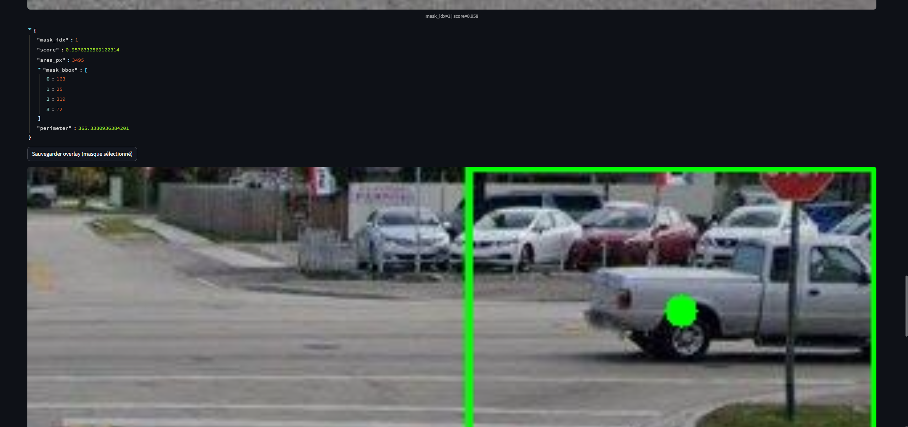
> En ajoutant un point FG au centre de la voiture, on obtient un masque plus précis qui exclut complètement le panneau. 
> 
> | image | bbox (x1,y1,x2,y2) | points (x,y,label) | mask_idx | score |
> | --- | --- | --- | --- | --- |
> | 25-7631026--80-3138276_A3_jpg.rf.29635599064dd345fbd99971fac460fd.jpg | (211,0,319,89) | NA | 2 | 0.8942 |
> | 25-7631026--80-3138276_A3_jpg.rf.29635599064dd345fbd99971fac460fd.jpg | (211,0,319,89) | FG:[246,54,1] | 1 | 0.8239 |


### Bilan et réflexion (POC vers produit) + remise finale

Cet exercice final sert à prendre du recul sur votre POC : ce qui marche bien, ce qui est fragile, et ce qu’il faudrait ajouter pour passer à une intégration “produit” (robuste, maintenable, observable).

Dans votre rapport, rédigez une réponse courte (8–12 lignes) à la question suivante : **quels sont les 3 principaux facteurs qui font échouer votre segmentation** (sur vos images), et quelles actions concrètes (data, UI, pipeline) permettraient d’améliorer la situation ?

> Les principaux facteurs d'échec de la segmentation sont : 
> 1) les fonds complexes avec plusieurs objets 
> 2) les objets fins ou partiellement occlus
> 3) les ambiguïtés dans les bboxes. 
>
> Pour améliorer la situation, il serait utile d'ajouter des points BG pour mieux définir les zones à exclure, de contraindre les bboxes pour qu'elles soient plus précises, et d'utiliser un post-traitement pour affiner les masques. De plus, un dataset dédié avec des annotations plus détaillées pourrait aider à entraîner le modèle de manière plus robuste.

Attendu : des observations concrètes issues de vos essais (fond complexe, transparence, objets fins, occlusions, ambiguïtés dans la bbox, etc.), et des pistes actionnables (points BG, contraintes bbox, post-traitement, dataset dédié, etc.).

> J'ai été étonnament surpris par la puissance du modèle SAM. En effet, même avec des images très faible en résolution et floutées issues de google maps (là d'ou vient le dataset majoritairement), j'ai pu obtenir des masques de segmentations très corrects. Même dans les cas où la bbox était très large et incluait plusieurs éléments, le modèle a réussi à identifier l'objet principal bien qu'en gardant des artefacts qu'il a fallu ensuite affiner.

Dans votre rapport, rédigez une réponse courte (8–12 lignes) à la question suivante : **si vous deviez industrialiser cette brique**, que loggueriez-vous et que monitoreriez-vous en priorité ? Donnez au minimum 5 éléments.

> Pour industrialiser cette brique, je logguerais en priorité :
> 1) les scores de segmentation pour chaque image, afin de suivre la qualité des prédictions
> 2) les temps d'inférence pour détecter les régressions de performance
> 3) les tailles des bboxes et des masques pour identifier les cas difficiles
> 4) les points FG/BG utilisés pour analyser leur impact sur les résultats
> 5) les erreurs ou échecs de segmentation pour comprendre les limites du modèle et guider les améliorations.

Ne restez pas théorique : proposez une liste de signaux mesurables et expliquez brièvement comment ils vous aideraient à détecter des régressions ou du drift.

Remise finale :

*   Vérifiez que votre dépôt contient bien TP1/ avec le code source et le rapport.
*   Vérifiez que vous n’avez pas ajouté de fichiers trop volumineux (notamment les checkpoints SAM).
*   Faites un **push** de votre dépôt et ajoutez un **tag** TP1 pointant vers la version rendue.
*   Envoyez le lien de votre dépôt à l’enseignant.