## CI : Génération d'image

Dans ce TP2, vous allez manipuler un modèle de diffusion _en inférence_ (pas d’entraînement) pour générer et modifier des images dans un contexte “produit e-commerce”. L’objectif est de comprendre, par l’expérimentation, comment les **paramètres** (seed, nombre d’étapes, guidance/CFG, scheduler, strength, etc.) influencent la qualité, la diversité et la fidélité au prompt, et comment transformer cette compréhension en un mini-outil utilisable.

Vous travaillerez dans le même dépôt que le TP1, en créant un dossier TP2/. L’exécution est recommandée sur le cluster SLURM (GPU 11GB) avec port forwarding pour Streamlit, mais une exécution locale reste possible (plus lente). Les livrables doivent rester légers : évitez de committer des fichiers volumineux (modèles, gros outputs) et privilégiez des **captures d’écran** dans rapport.md.

*   Charger et exécuter un pipeline de diffusion (text-to-image, image-to-image) avec **Hugging Face Diffusers**, en exploitant le GPU quand disponible.
*   Rendre une génération **reproductible** (seed, configuration) et documenter précisément les paramètres utilisés.
*   Explorer systématiquement l’impact des paramètres clés : **num\_inference\_steps**, **guidance\_scale**, **scheduler**, et **strength** (img2img).
*   Construire un mini-produit **Streamlit** orienté e-commerce, permettant text2img et img2img avec paramètres configurables.
*   Produire un rapport **Markdown** pragmatique (captures, commandes, observations, courte réflexion) sans livrer de fichiers trop volumineux.

### Mise en place & smoke test (GPU + Diffusers)

L’exécution est recommandée sur le cluster SLURM (GPU 11GB). Faites l’installation des dépendances **après** avoir obtenu une allocation GPU. En local, cela fonctionne aussi mais la génération sera nettement plus lente.

Dans TP2/, installez (ou mettez à jour) les dépendances nécessaires dans l’environnement Python que vous utilisez déjà. Vous n’avez pas besoin de documenter cette étape dans le rapport.

Dépendances minimales : diffusers, transformers, accelerate, safetensors, torch, pillow.

Réalisez un smoke test sur GPU en générant **une seule image** (512×512) avec Stable Diffusion v1.5 via un script Python. Créez un fichier TP2/smoke\_test.py avec le contenu ci-dessous, puis exécutez-le.

Si vous êtes sur le cluster : exécutez ce script **sur le nœud GPU**. Le premier lancement télécharge le modèle (temps variable).

```python
from __future__ import annotations
import os
import torch
from diffusers import StableDiffusionPipeline

MODEL_ID = "stable-diffusion-v1-5/stable-diffusion-v1-5"

def main() -> None:
    device = "cuda" if torch.cuda.is_available() else "cpu"
    dtype = torch.float16 if device == "cuda" else torch.float32

    print(f"[smoke] device={device} dtype={dtype}")

    pipe = StableDiffusionPipeline.from_pretrained(
        MODEL_ID,
        torch_dtype=dtype,
        # safety checker conservé par défaut
    ).to(device)

    # Aide VRAM sur GPU ~11GB
    pipe.enable_attention_slicing()

    prompt = "ultra-realistic product photo of a watch on a white background, studio lighting, soft shadow, very sharp"
    negative = "text, watermark, logo, low quality, blurry, deformed"

    g = torch.Generator(device=device).manual_seed(42)

    out = pipe(
        prompt=prompt,
        negative_prompt=negative,
        num_inference_steps=25,
        guidance_scale=7.5,
        height=512,
        width=512,
        generator=g,
    )

    img = out.images[0]
    os.makedirs("outputs", exist_ok=True)
    path = os.path.join("outputs", "smoke.png")
    img.save(path)
    print(f"[smoke] saved: {path}")

if __name__ == "__main__":
    main()
```

Utilisez scp par exemple pour télécharger les images depuis le cluster sur votre machine.

Si le smoke test échoue (OOM, erreurs CUDA, etc.), appliquez **au moins une** des actions ci-dessous, puis relancez le script jusqu’à obtenir une image. Documentez uniquement **le diagnostic utile** (pas les commandes triviales).

*   Réduire num\_inference\_steps (ex: 15–20).
*   Vérifier que torch\_dtype est bien en float16 sur GPU.
*   Activer pipe.enable\_attention\_slicing() (déjà fait ici).
*   Fermer d’autres jobs/process GPU, si applicable.

**À mettre dans le rapport** pour cet exercice : une capture (ou export léger) de l’image smoke.png et, si vous avez eu un souci, une phrase sur la cause et le correctif (ex: “OOM résolu en passant de 50 à 20 steps”).

> 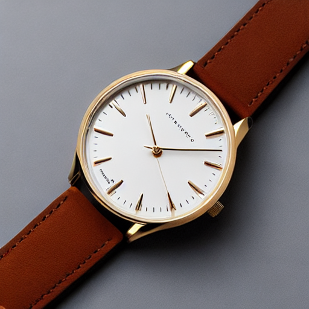
>
> *Image générée lors du smoke test. Pas de problème rencontré.*

### Factoriser le chargement du pipeline (text2img/img2img) et exposer les paramètres

Pour garder le TP simple et reproductible, on va centraliser le chargement du modèle et la gestion des paramètres (device/dtype, scheduler, seed) dans un module utilitaire. Cela évite de “copier-coller” du code partout et facilite le debug.

Créez le fichier TP2/pipeline\_utils.py et complétez les **trous** (\_\_\_\_\_\_\_) pour obtenir :

*   un chargement text2img (StableDiffusionPipeline) avec choix du **scheduler**,
*   un chargement img2img qui réutilise les composants du pipeline text2img,
*   un générateur reproductible basé sur la **seed**.

Modèles suggérés (sans authentification) :

*   stable-diffusion-v1-5/stable-diffusion-v1-5 (512×512, bon compromis)
*   sd2-community/stable-diffusion-2-1-base (512×512, alternative SD2.1 “mirror”)

Sur GPU 11GB : commencez en 512×512, fp16 sur CUDA, et gardez enable\_attention\_slicing().

```python
from __future__ import annotations

from typing import Dict
import torch
from diffusers import (
    StableDiffusionPipeline,
    StableDiffusionImg2ImgPipeline,
    DDIMScheduler,
    EulerAncestralDiscreteScheduler,
    DPMSolverMultistepScheduler,
)

# Choisissez un modèle par défaut
DEFAULT_MODEL_ID = "_______"  # ex: "stable-diffusion-v1-5/stable-diffusion-v1-5"

SCHEDULERS: Dict[str, object] = {
    "DDIM": DDIMScheduler,
    "EulerA": EulerAncestralDiscreteScheduler,
    "DPM++": DPMSolverMultistepScheduler,
}

def get_device() -> str:
    # TODO: retourner "cuda" si disponible, sinon "cpu"
    return "_______"

def get_dtype(device: str):
    # TODO: fp16 sur cuda, fp32 sinon
    return torch._______ if device == "cuda" else torch._______

def make_generator(seed: int, device: str) -> torch.Generator:
    g = torch.Generator(device=device)
    g.manual_seed(seed)
    return g

def set_scheduler(pipe, scheduler_name: str):
    # TODO: remplacer le scheduler courant par celui choisi
    cls = SCHEDULERS[_______]
    pipe.scheduler = cls.from_config(pipe.scheduler.config)
    return pipe

def load_text2img(model_id: str, scheduler_name: str):
    device = get_device()
    dtype = get_dtype(device)

    pipe = StableDiffusionPipeline.from_pretrained(
        model_id,
        torch_dtype=dtype,
        # safety checker conservé par défaut
    ).to(device)

    # Aide VRAM (utile sur GPU ~11GB)
    pipe.enable_attention_slicing()

    pipe = set_scheduler(pipe, scheduler_name)
    return pipe

def to_img2img(text2img_pipe):
    # TODO: créer un pipeline img2img qui réutilise exactement les mêmes composants
    return StableDiffusionImg2ImgPipeline(**text2img_pipe._______)
```

Créez le fichier TP2/experiments.py (script d’exécution minimal) et complétez les trous pour produire une image text2img “baseline” (512×512) avec des paramètres explicitement définis. Vous devez sauvegarder l’image dans TP2/outputs/.

Ce script sera réutilisé ensuite pour lancer vos expériences sans dépendre de Streamlit. Gardez-le volontairement simple : une exécution = une génération = un fichier image.

```python
from __future__ import annotations

import os
from PIL import Image
from pipeline_utils import DEFAULT_MODEL_ID, load_text2img, get_device, make_generator

def save(img: Image.Image, path: str) -> None:
    os.makedirs(os.path.dirname(path), exist_ok=True)
    img.save(path)

def main() -> None:
    model_id = DEFAULT_MODEL_ID
    scheduler_name = "_______"  # "EulerA" recommandé pour démarrer
    seed = 42
    steps = 30
    guidance = 7.5

    prompt = "ultra-realistic product photo of a backpack on a white background, studio lighting, soft shadow, very sharp"
    negative = "text, watermark, logo, low quality, blurry, deformed"

    pipe = load_text2img(model_id, scheduler_name)
    device = get_device()
    g = make_generator(seed, device)

    out = pipe(
        prompt=_______,
        negative_prompt=_______,
        num_inference_steps=_______,
        guidance_scale=_______,
        height=512,
        width=512,
        generator=_______,
    )

    img = out.images[0]
    save(img, "outputs/baseline.png")

    print("OK saved outputs/baseline.png")
    print("CONFIG:", {"model_id": model_id, "scheduler": scheduler_name, "seed": seed, "steps": steps, "guidance": guidance})

if __name__ == "__main__":
    main()
```

**À mettre dans le rapport** pour cet exercice : une capture de baseline.png + la configuration affichée (model\_id, scheduler, seed, steps, guidance). Ne mettez pas de détails trivials.

> 
> 
> *Image générée pour la baseline text2img.*
>
>Paramètres affichés dans le terminal :
>```bash
> OK saved outputs/baseline.png
> CONFIG: {'model_id': 'stable-diffusion-v1-5/stable-diffusion-v1-5', 'scheduler': 'EulerA', 'seed': 42, 'steps': 30, 'guidance': 7.5}
> ```

### Text2Img : 6 expériences contrôlées (paramètres steps, guidance, scheduler)

Dans cet exercice, vous allez mener des expériences **contrôlées** : on change un seul paramètre à la fois, on conserve le même prompt et la même seed, et on compare visuellement les résultats. L’objectif est de comprendre l’effet des paramètres num\_inference\_steps, guidance\_scale et scheduler.

Dans TP2/experiments.py, ajoutez une fonction run\_text2img\_experiments() qui génère automatiquement **6 images** (512×512) selon le plan ci-dessous, et les sauvegarde dans TP2/outputs/.

Plan imposé (même prompt, même seed) :

*   **Run 01** : baseline — steps=30, guidance=7.5, scheduler=EulerA
*   **Run 02** : steps bas — steps=15
*   **Run 03** : steps haut — steps=50
*   **Run 04** : guidance bas — guidance=4.0
*   **Run 05** : guidance haut — guidance=12.0
*   **Run 06** : scheduler différent — scheduler=DDIM (steps=30, guidance=7.5)

*   Gardez une convention de nommage claire, par exemple t2i\_run01\_baseline.png, etc.
*   Affichez dans le terminal (print) la configuration de chaque run (au moins : scheduler/seed/steps/guidance).
*   Ne changez pas la seed entre les runs (sinon l’analyse est biaisée).

```python
# À insérer dans TP2/experiments.py

def run_text2img_experiments() -> None:
    model_id = DEFAULT_MODEL_ID
    seed = 42
    prompt = "_______"  # TODO: choisissez un prompt e-commerce en anglais unique et gardez-le identique pour tous les runs
    negative = "text, watermark, logo, low quality, blurry, deformed"

    plan = [
        # name, scheduler, steps, guidance
        ("run01_baseline", "EulerA", 30, 7.5),
        ("run02_steps15", "EulerA", 15, 7.5),
        ("run03_steps50", "EulerA", 50, 7.5),
        ("run04_guid4",  "EulerA", 30, 4.0),
        ("run05_guid12", "EulerA", 30, 12.0),
        ("run06_ddim",   "DDIM",   30, 7.5),
    ]

    for name, scheduler_name, steps, guidance in plan:
        pipe = load_text2img(model_id, scheduler_name)
        device = get_device()
        g = make_generator(seed, device)

        out = pipe(
            prompt=_______,
            negative_prompt=_______,
            num_inference_steps=_______,
            guidance_scale=_______,
            height=512,
            width=512,
            generator=_______,
        )

        img = out.images[0]
        save(img, f"outputs/t2i_{name}.png")
        print("T2I", name, {"scheduler": scheduler_name, "seed": seed, "steps": steps, "guidance": guidance})
```

Exécutez TP2/experiments.py de façon à lancer ces 6 générations. Vous devez obtenir 6 fichiers outputs/t2i\_\*.png.

Si vous avez déjà une fonction main(), appelez run\_text2img\_experiments() depuis main(). Ne créez pas de nouveau script complet.

Faites une comparaison qualitative des 6 résultats (sans métrique). Dans votre rapport.md, produisez :

*   une grille de captures (ou 6 captures séparées) montrant les résultats,
*   un court commentaire (bullet points) décrivant l’effet de **steps**, **guidance** et **scheduler**.

Exemple d’axes d’analyse : netteté, artefacts (mains/texte/logos), respect du prompt, diversité de composition, lumière/ombres.

> 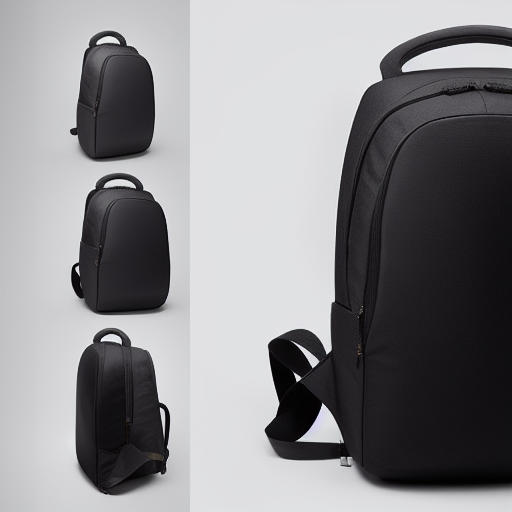
> 
> *Image de la baseline (run 01) avec scheduler EulerA, steps=30, guidance=7.5.*
>
> 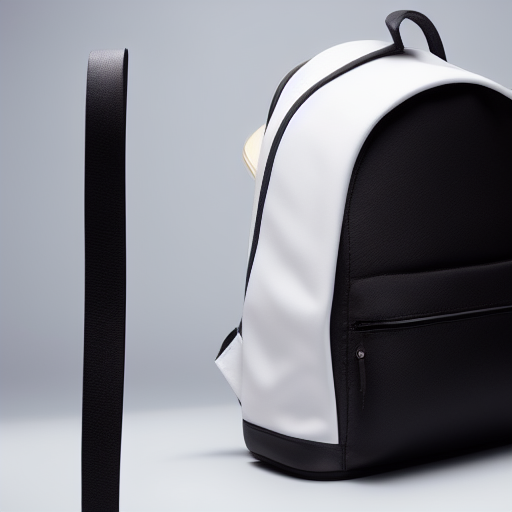
>
> *Image avec steps bas (15) : plus rapide, mais moins de détails et plus d’artefacts.*
>
> 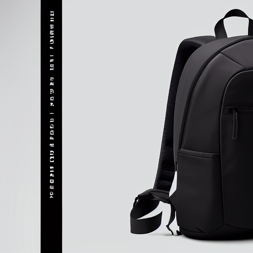
>
> *Image avec steps élevés (50) : plus de détails, mais plus lent.*
>
> 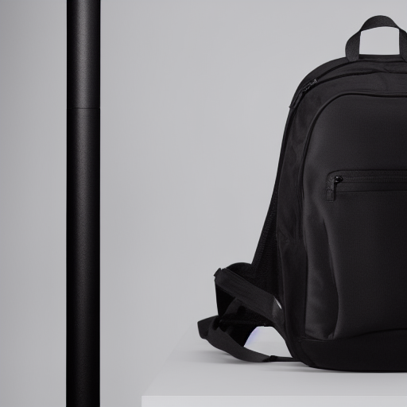
>
> *Image avec guidance bas (4.0) : plus créative, mais moins fidèle au prompt.*
> 
> 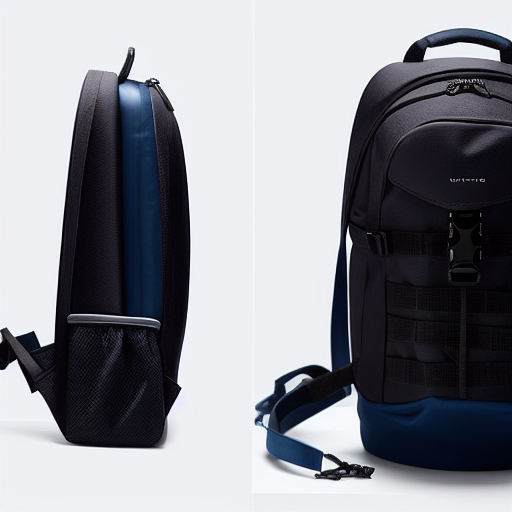
>
> *Image avec guidance élevé (12.0) : plus fidèle au prompt, mais moins créative.*
>
> 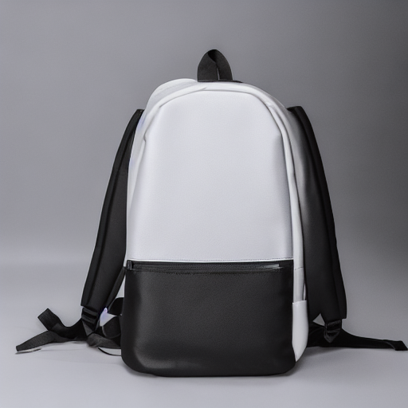

### Img2Img : 3 expériences contrôlées (strength faible/moyen/élevé)

L’objectif ici est de comprendre le paramètre strength en image-to-image : plus strength est élevé, plus le modèle s’éloigne de l’image d’entrée (créativité augmente, fidélité structurelle diminue).

Dans TP2/experiments.py, ajoutez une fonction run\_img2img\_experiments() et complétez les trous pour générer **3 images** à partir d’une image source (à fournir par vous). L’image source doit être une image “produit e-commerce” (photo personnelle ou trouvée sur internet).

*   Placez votre image source dans TP2/inputs/ (ne pas committer si trop lourde ; sinon préférez une image légère).
*   Conservez la même **seed**, le même **scheduler**, le même **steps** et le même **guidance** entre les 3 runs.
*   Utilisez le même prompt pour les 3 runs.

```python
# À insérer dans TP2/experiments.py
from pipeline_utils import to_img2img

def run_img2img_experiments() -> None:
    model_id = DEFAULT_MODEL_ID
    seed = 42
    scheduler_name = "EulerA"
    steps = 30
    guidance = 7.5

    # TODO: fournissez une image source (produit) dans TP2/inputs/
    init_path = "inputs/_______"  # ex: "my_product.jpg"

    prompt = "_______"   # TODO: prompt e-commerce (en anglais)
    negative = "text, watermark, logo, low quality, blurry, deformed"

    strengths = [
        ("run07_strength035", 0.35),
        ("run08_strength060", 0.60),
        ("run09_strength085", 0.85),  # strength élevé obligatoire
    ]

    pipe_t2i = load_text2img(model_id, scheduler_name)
    pipe_i2i = to_img2img(pipe_t2i)

    device = get_device()
    g = make_generator(seed, device)

    init_image = Image.open(init_path).convert("RGB")

    for name, strength in strengths:
        out = pipe_i2i(
            prompt=_______,
            image=_______,
            strength=_______,
            negative_prompt=_______,
            num_inference_steps=_______,
            guidance_scale=_______,
            generator=_______,
        )
        img = out.images[0]
        save(img, f"outputs/i2i_{name}.png")
        print("I2I", name, {"scheduler": scheduler_name, "seed": seed, "steps": steps, "guidance": guidance, "strength": strength})
```

Exécutez vos 3 générations Img2Img (les runs 07–09) et obtenez les fichiers outputs/i2i\_\*.png. Assurez-vous d’avoir aussi une capture “avant” (image source) pour la comparaison.

Si vous avez déjà une fonction main(), appelez run\_img2img\_experiments() depuis main().

Dans rapport.md, comparez qualitativement les résultats pour strength=0.35, 0.60 et 0.85 (captures + bullet points). Votre analyse doit inclure :

*   ce qui est conservé (forme globale, identité du produit, cadrage),
*   ce qui change (textures, arrière-plan, éclairage, détails),
*   un commentaire sur l’utilisabilité e-commerce (risque “trop loin” à strength élevé).

Pour les livrables : ne committez pas l’image source si elle est trop lourde. Les captures dans rapport.md suffisent.
> *Image source (input) pour les expériences Img2Img. Photo d’un sac à dos sur fond neutre.*
> ---
> 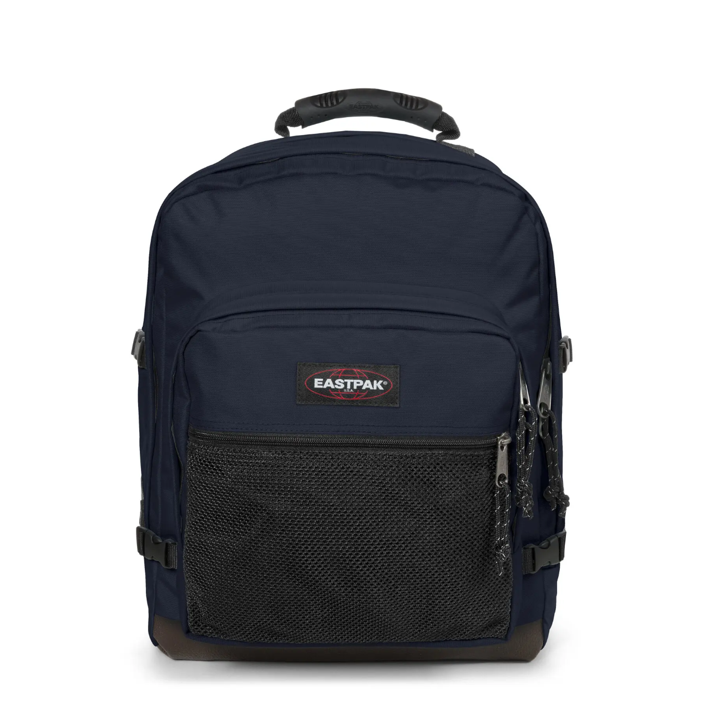
> *Image avec strength 0.35*
> ---
> 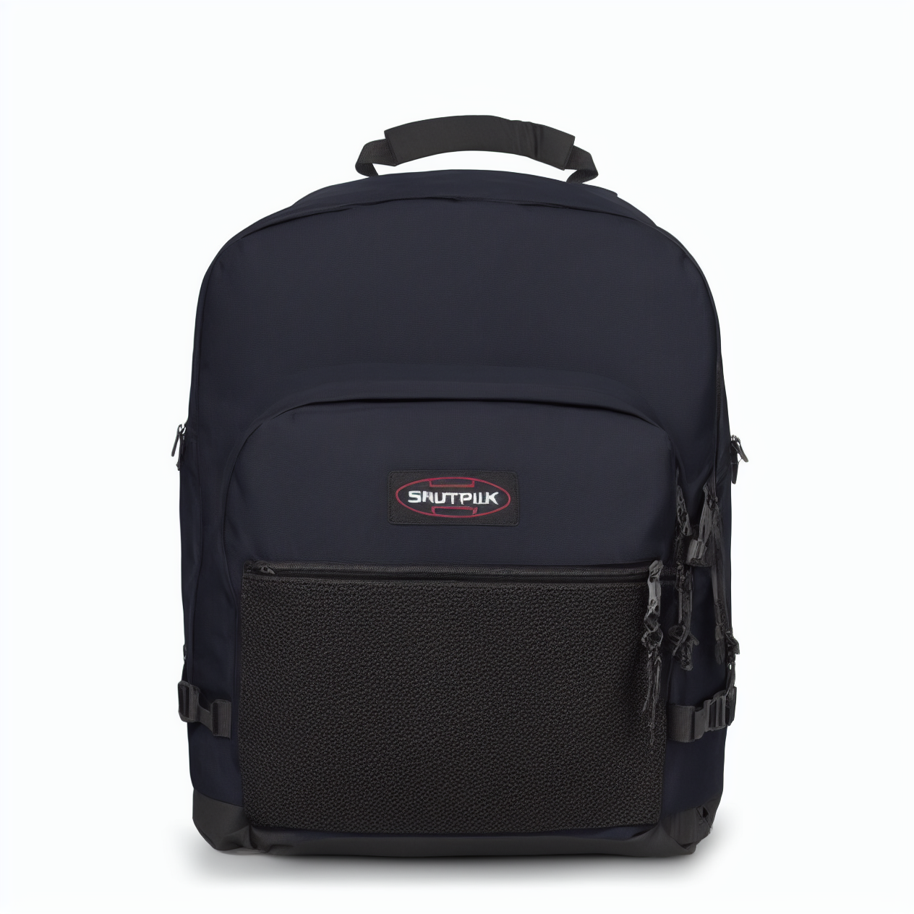
>
> *Image avec strength 0.60*
> ---
> 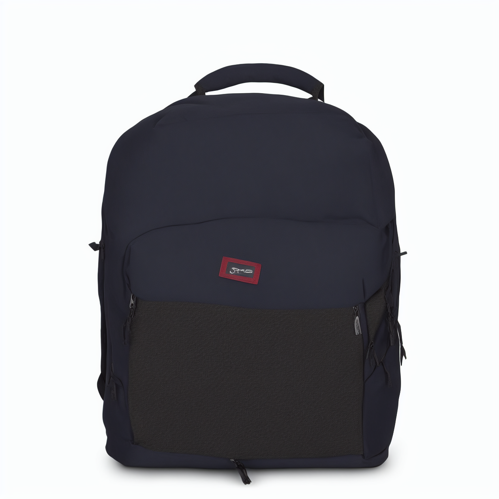
>
> *Image avec strength 0.85*
> ---
> 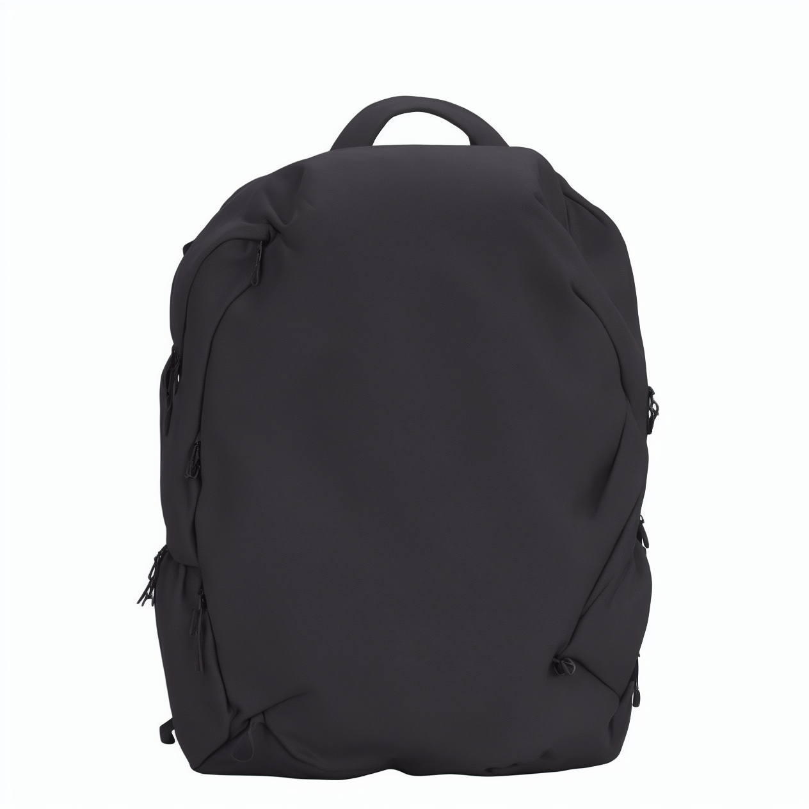
>
> *Analyse qualitative :*
> - Plus la strength augmente, plus l’image générée s’éloigne de l’image source : changement de textures, destruction du texte, modification des couleurs et des détails fins.
> - Cependant, la forme globale du sac à dos et son identité restent reconnaissables même à strength 0.85. Par exemple, la forme du sac et sa poignée sont conservées peu importe la strength.
> - Pour un usage e-commerce, une strength trop élevée (ex: 0.85) peut être risquée car elle peut altérer des détails importants du produit (ex: motifs, couleurs spécifiques) et donner une impression de “trop loin” par rapport à la réalité du produit. Une strength modérée (ex: 0.35–0.60) semble offrir un bon compromis entre créativité et fidélité.

### Mini-produit Streamlit (MVP) : Text2Img + Img2Img avec paramètres

Objectif : assembler un mini-outil “e-commerce” minimal mais utilisable. Vous devez pouvoir (i) générer en text2img, (ii) transformer une image en img2img, (iii) piloter les paramètres (seed/steps/guidance/scheduler/strength), et (iv) afficher la configuration utilisée pour la reproductibilité.

Créez (ou complétez) TP2/app.py en ajoutant un bloc “imports + chargement caché (cache)” ci-dessous. Complétez les trous (\_\_\_\_\_\_\_).

*   Le cache Streamlit évite de re-télécharger / re-charger le modèle à chaque interaction.
*   Le pipeline doit être rechargé si model\_id ou scheduler\_name changent.

```python
# À placer au début de TP2/app.py

import streamlit as st
from PIL import Image

from pipeline_utils import (
    DEFAULT_MODEL_ID,
    load_text2img,
    to_img2img,
    get_device,
    make_generator,
)

st.set_page_config(page_title="TP2 - Diffusion e-commerce", layout="wide")

@st.cache_resource
def get_text2img_pipe(model_id: str, scheduler_name: str):
    # TODO: charger le pipeline text2img
    return load_text2img(_______, _______)
```

Ajoutez maintenant un bloc “UI” (sidebar + zones de texte) qui permet de sélectionner :

*   le mode (Text2Img / Img2Img),
*   les paramètres : seed, steps, guidance, scheduler,
*   le prompt et le negative\_prompt,
*   pour Img2Img : upload de l’image + strength.

Complétez les trous.

```python
# À placer après le bloc précédent dans TP2/app.py

st.title("TP2 — Diffusion mini-product (e-commerce)")

mode = st.sidebar.selectbox("Mode", ["Text2Img", "Img2Img"])

model_id = st.sidebar.text_input("Model ID", value=DEFAULT_MODEL_ID)
scheduler_name = st.sidebar.selectbox("Scheduler", ["EulerA", "DDIM", "DPM++"])

seed = st.sidebar.number_input("Seed", min_value=0, max_value=10_000_000, value=42, step=1)
steps = st.sidebar.slider("Steps", 5, 60, 30)
guidance = st.sidebar.slider("Guidance (CFG)", 1.0, 15.0, 7.5, 0.5)

prompt = st.text_area("Prompt", value="_______")
negative_prompt = st.text_area("Negative prompt", value="text, watermark, logo, low quality, blurry, deformed")

init_image = None
strength = None
if mode == "Img2Img":
    up = st.file_uploader("Input image (img2img)", type=["png", "jpg", "jpeg"])
    strength = st.slider("Strength", 0.0, 0.95, 0.60, 0.05)
    if up is not None:
        init_image = Image.open(up).convert("RGB")
        st.image(init_image, caption="Input image", use_container_width=True)

run = st.button("Generate", type="primary")
```

Ajoutez le bloc “génération” : au clic sur Generate, exécutez soit text2img soit img2img, affichez l’image de sortie et affichez la configuration (paramètres) sous forme lisible. Complétez les trous.

*   Pour la reproductibilité : recréez le générateur (make\_generator) à chaque génération (seed fixe).
*   Si Img2Img est sélectionné, refusez de générer si aucune image n’est uploadée.

```python
# À placer après le bloc UI dans TP2/app.py

if run:
    if mode == "Img2Img" and init_image is None:
        st.error("Please upload an input image for Img2Img.")
        st.stop()

    pipe_t2i = get_text2img_pipe(model_id, scheduler_name)
    device = get_device()
    g = make_generator(int(seed), device)

    if mode == "Text2Img":
        out = pipe_t2i(
            prompt=_______,
            negative_prompt=_______,
            num_inference_steps=_______,
            guidance_scale=_______,
            height=512,
            width=512,
            generator=_______,
        )
        img = out.images[0]
        config = {
            "mode": "Text2Img",
            "model_id": model_id,
            "scheduler": scheduler_name,
            "seed": int(seed),
            "steps": int(steps),
            "guidance": float(guidance),
            "height": 512,
            "width": 512,
        }
    else:
        pipe_i2i = to_img2img(pipe_t2i)
        out = pipe_i2i(
            prompt=_______,
            image=_______,
            strength=_______,
            negative_prompt=_______,
            num_inference_steps=_______,
            guidance_scale=_______,
            generator=_______,
        )
        img = out.images[0]
        config = {
            "mode": "Img2Img",
            "model_id": model_id,
            "scheduler": scheduler_name,
            "seed": int(seed),
            "steps": int(steps),
            "guidance": float(guidance),
            "strength": float(strength),
            "height": 512,
            "width": 512,
        }

    st.image(img, caption=f"{config['mode']} | {config['scheduler']} | seed={config['seed']}", use_container_width=True)
    st.subheader("Config (for reproducibility)")
    st.json(config)
```

**À mettre dans le rapport** pour cet exercice : deux captures de l’application (une en Text2Img, une en Img2Img) montrant l’image générée et le bloc Config affiché.

Pour lancer l'application streamlit tournant sur le cluster: PORT=\_\_\_\_\_\_\_ et streamlit run app.py --server.port \$PORT --server.address 0.0.0.0 puis sur votre machine ssh -L ${PORT}:localhost:${PORT} nodeX-tsp

> *Capture de l’application Streamlit en mode Text2Img, avec l’image générée et la configuration affichée.*
> ---
> 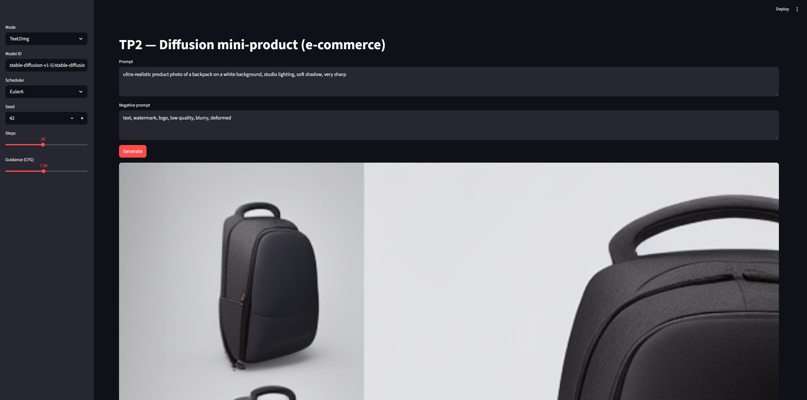
> 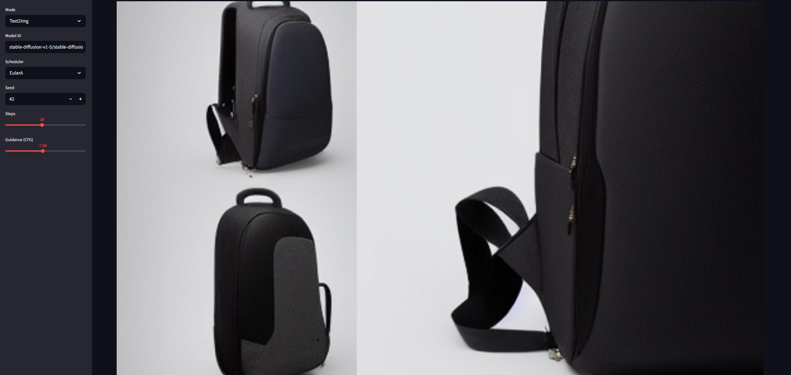
> 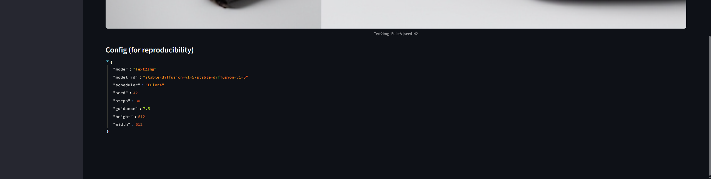
>
> *Capture de l’application Streamlit en mode Img2Img, avec l’image générée et la configuration affichée.*
> ---
> 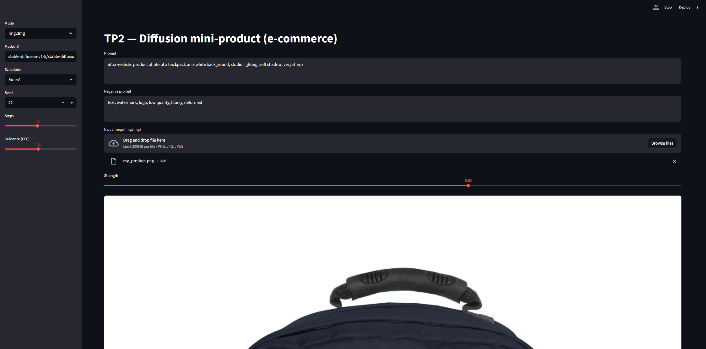
> 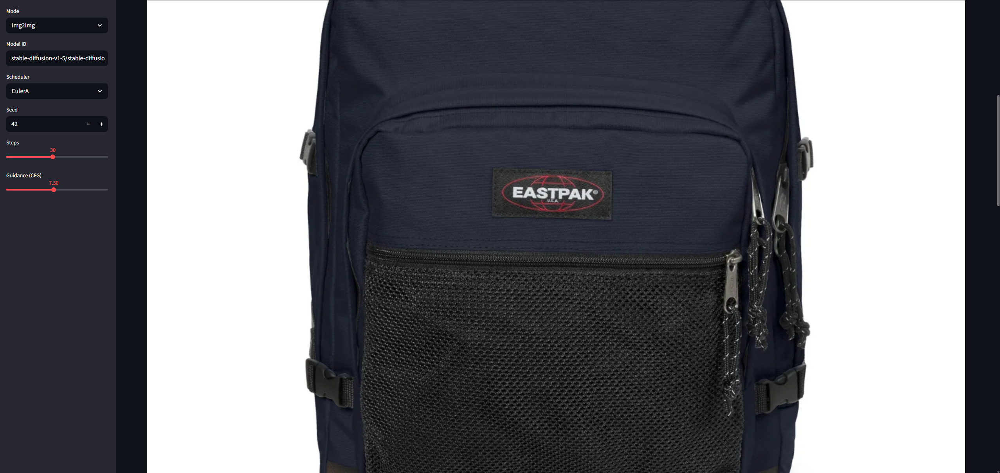
> 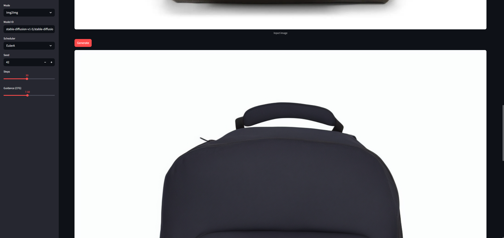
> 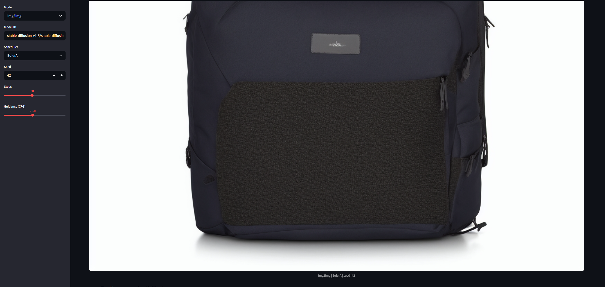
> 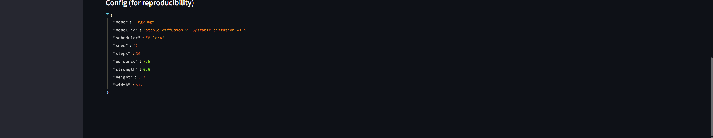


### Évaluation (léger) + réflexion (à finir à la maison)

La génération d’images n’a pas de “bonne réponse unique”. L’objectif ici est de définir une évaluation simple, répétable, et utile en contexte e-commerce, puis de prendre du recul sur les limites et risques. Pour garder l’implémentation Streamlit minimale (et éviter des changements importants liés au rechargement de l’UI), l’évaluation sera faite **dans le rapport**, sans code.

Dans rapport.md, définissez et utilisez la grille d’évaluation “light” suivante (scores entiers 0–2), puis calculez un total sur 10.

*   **Prompt adherence** (0–2)
*   **Visual realism** (0–2)
*   **Artifacts** (0–2) — 2 = aucun artefact gênant
*   **E-commerce usability** (0–2) — 2 = publiable après retouches mineures
*   **Reproducibility** (0–2) — 2 = paramètres suffisants pour reproduire

Cette évaluation est **humaine**. Elle sert surtout à structurer votre analyse et à comparer des runs. Vous n’avez pas besoin d’un tableau sophistiqué : des bullet points avec le calcul du total suffisent.

Évaluez **au moins 3** images parmi vos générations :

*   une text2img baseline,
*   une text2img avec un paramètre “extrême” (guidance haut ou steps bas/haut),
*   une img2img à **strength élevé**.

Pour chacune : reportez les 5 scores (0–2), le total sur 10, et 2–3 bullets de justification.

Rédigez un paragraphe de réflexion (8–12 lignes) à la fin de rapport.md. Il doit obligatoirement couvrir les 3 points suivants :

*   Le compromis **quality vs latency/cost** quand on ajuste steps/scheduler.
*   La **reproductibilité** : quels paramètres sont nécessaires et ce qui peut casser.
*   Les risques en e-commerce : **hallucinations**, images trompeuses, conformité (logos/texte), et ce que vous feriez pour limiter ces risques.

Appuyez-vous sur un exemple concret observé pendant le TP (ex : “à strength=0.85, le produit dérive trop”).

Rappel : évitez de committer des fichiers volumineux. Les captures d’écran dans rapport.md suffisent.

> **Grille d'évaluation:**
> | Génération | Prompt adherence | Visual realism | Artifacts | E-commerce usability | Reproducibility | Total |
> |------------------|------------------|-----------------|-----------|----------------------|-----------------|-------|
> | text2img baseline | 2                | 2               | 1         | 2                    | 2               | 9/10  |
> | text2img haute guidance | 1                | 1               | 1         | 0                    | 2               | 5/10  |
> | img2img strength élevé | 1                | 1               | 0         | 0                    | 2               | 3/10  |
>
> **Analyse qualitative :**
>
> Ce TP a montré que les modèles de diffusion offrent une grande flexibilité pour la génération d'images e-commerce, mais au prix de compromis délicats.
> 
> **Quality vs latency.** Réduire les steps de 50 à 15 (run03 vs run02) divise le temps de calcul par environ trois, mais introduit des artefacts visibles et une perte de détail inacceptable pour un catalogue produit. La baseline de 30 steps avec scheduler EulerA (run01, 9/10) représente un bon équilibre. Le scheduler DDIM (run06) produit des résultats comparables à EulerA pour le même nombre de steps, sans avantage qualitatif notable sur ce type de sujet.
> 
> **Reproductibilité.** Nos tests confirment que seed, steps, guidance, scheduler et model\_id sont des paramètres critiques ; les omettre rend impossible de rejouer une génération. Cependant, recharger le modèle, changer la version de diffusers ou basculer de float16 à float32 peut altérer légèrement les pixels finaux, ce qui impose une documentation stricte de l'environnement d'exécution complet.
> 
> **Risques e-commerce.** Trois menaces principales émergent : (1) les **hallucinations produit** (artefacts textuels involontaires sur le sac, distorsions de texture, couleurs non représentatives) qui rendent l'image non publiable — observées notamment à guidance=4.0 et strength élevé ; (2) les **déviations trompeuses**, à strength=0.85 (run09, 3/10, usabilité=0), où la structure globale du sac est conservée mais les détails (couleur, motifs, matière) dérivent au point de ne plus représenter fidèlement le produit réel ; (3) la **sur-saturation stylistique** à guidance=12.0 (run05, 5/10, usabilité=0), qui produit des images irréalistes inutilisables dans un catalogue.
> 
> Pour limiter ces risques : ajouter une review humaine systématique avant publication, imposer des limites strictes sur strength (≤0.60) et guidance (≤9.0), utiliser des prompts négatifs robustes, et versionner précisément chaque configuration. Un système de A/B testing avec métriques clientes (taux de clic, taux de retour) permettrait ensuite d'itérer de façon sûre.