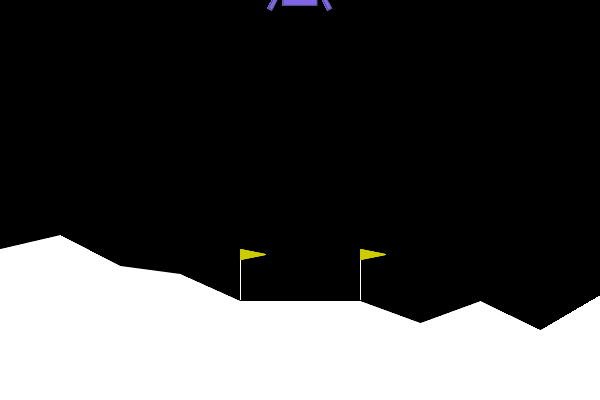
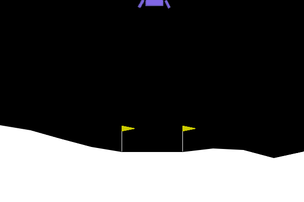
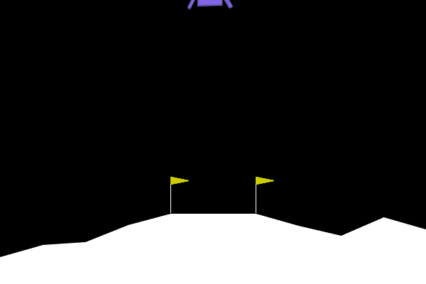
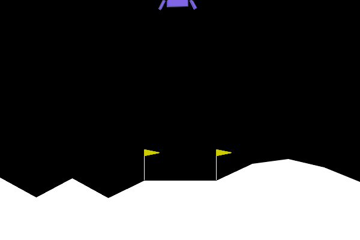

## CI : Deep Reinforcement Learning

Bienvenue dans ce cinquième TP consacré à l'Apprentissage par Renforcement Profond (Deep Reinforcement Learning). Jusqu'à présent, vous avez manipulé des modèles supervisés ou génératifs travaillant sur des ensembles de données statiques. Aujourd'hui, vous allez concevoir un agent autonome capable d'interagir avec son environnement, de prendre des décisions séquentielles et d'apprendre de ses erreurs pour accomplir une tâche complexe : faire atterrir un module lunaire en douceur.

Dans cette session orientée ingénierie, nous allons nous concentrer sur le déploiement pragmatique. Vous utiliserez les standards de l'industrie : **Gymnasium** pour la simulation physique de l'environnement (LunarLander-v3) et **Stable Baselines3** pour instancier un modèle PPO (Proximal Policy Optimization). Avant de commencer, assurez-vous de créer un répertoire TP5 dans le dépôt Git de votre module et d'y initialiser votre fichier de rapport (rapport.md).

*   Appréhender l'API standard de l'écosystème RL (Gymnasium) en manipulant les espaces d'états et d'actions.
*   Déployer et entraîner un algorithme de Deep RL de l'état de l'art (PPO) en quelques lignes de code.
*   Analyser et interpréter les métriques d'apprentissage spécifiques au RL (récompense moyenne) pour valider la convergence.
*   Évaluer quantitativement et qualitativement un agent en inférence (déploiement).

### Comprendre la Matrice et Instrumenter l'Environnement (Exploration de Gymnasium)

Assurez-vous que votre environnement virtuel contient les paquets nécessaires. Vous devriez avoir besoin d'installer la simulation physique de la lune et la manipulation d'images avec pip install "gymnasium\[box2d\]" stable-baselines3 Pillow.

Avant de demander à une IA de résoudre un problème, un ingénieur doit d'abord s'assurer qu'il comprend parfaitement les entrées, les sorties, et savoir comment mesurer la performance de son système. Créez un fichier random\_agent.py et complétez les trous pour initialiser l'environnement LunarLander-v3, faire agir un agent de manière aléatoire, enregistrer une vidéo (GIF), et calculer des métriques de vol (carburant, crash, score).

```python
import gymnasium as gym
from PIL import Image

# Initialisation de l'environnement avec le mode de rendu pour extraire les images
env = gym.make("LunarLander-v3", render_mode=________)

print("Espace d'observation (Capteurs) :", env.observation_space)
print("Espace d'action (Moteurs) :", env.action_space)

obs, info = env.reset()
done = False
frames = []

# Initialisation de nos métriques de télémétrie
total_reward = 0.0
main_engine_uses = 0
side_engine_uses = 0

while not done:
    # L'agent choisit une action aléatoire (0: Rien, 1: Gauche, 2: Principal, 3: Droite)
    action = env.action_space.________()
    
    # L'environnement applique l'action et retourne les nouvelles valeurs
    obs, reward, terminated, truncated, info = env.step(________)
    
    # Mise à jour des métriques
    total_reward += ________
    if action == 2:
        main_engine_uses += 1
    elif action in [1, 3]:
        side_engine_uses += 1
        
    # Capture de l'image courante de la simulation
    frame = env.________()
    frames.append(Image.fromarray(frame))
    
    done = terminated or truncated

env.close()

# Analyse de l'issue du vol (un crash donne -100 à la dernière étape, un succès +100)
if reward == -100:
    issue = "CRASH DÉTECTÉ 💥"
elif reward == 100:
    issue = "ATTERRISSAGE RÉUSSI 🏆"
else:
    issue = "TEMPS ÉCOULÉ OU SORTIE DE ZONE ⚠️"

print("\n--- RAPPORT DE VOL ---")
print(f"Issue du vol : {issue}")
print(f"Récompense totale cumulée : {total_reward:.2f} points")
print(f"Allumages moteur principal : {main_engine_uses}")
print(f"Allumages moteurs latéraux : {side_engine_uses}")
print(f"Durée du vol : {len(frames)} frames")

# Sauvegarde de l'animation
if frames:
    frames[0].save('random_agent.gif', save_all=True, append_images=frames[1:], duration=30, loop=0)
    print("Vidéo de la télémétrie sauvegardée sous 'random_agent.gif'")
```

Pour la méthode d'action, cherchez du côté de sample(). Pour récupérer l'image, la méthode classique de l'environnement s'appelle render() et le mode d'initialisation pour obtenir des matrices de pixels est généralement "rgb\_array".

Exécutez votre script. Dans votre rapport Markdown, intégrez le GIF généré random\_agent.gif ainsi qu'une copie du rapport de vol affiché dans votre terminal. Un agent est considéré comme "résolvant" l'environnement s'il obtient un score moyen de +200 points. À quel point votre agent aléatoire en est-il loin ?

> **Espace d'observation et d'action :**
>
> ```
> Espace d'observation (Capteurs) : Box([-2.5, -2.5, -10., -10., -6.2831855, -10., -0., -0.],
>                                        [ 2.5,  2.5,  10.,  10.,  6.2831855,  10.,  1.,  1.], (8,), float32)
> Espace d'action (Moteurs) : Discrete(4)
> ```
>
> L'espace d'observation est un vecteur de 8 flottants : position (x, y), vitesses (vx, vy), angle et vitesse angulaire, et deux booléens de contact des jambes. L'espace d'action est discret à 4 valeurs : 0 (rien), 1 (moteur gauche), 2 (moteur principal), 3 (moteur droit).
>
> **GIF agent aléatoire :** 
>
> **Rapport de vol :**
>
> ```
> --- RAPPORT DE VOL ---
> Issue du vol : CRASH DETECTE
> Recompense totale cumulee : -85.99 points
> Allumages moteur principal : 30
> Allumages moteurs lateraux : 58
> Duree du vol : 122 frames
> Video de la telemetrie sauvegardee sous 'random_agent.gif'
> ```
>
> L'agent aléatoire obtient **-85.99 points**, soit un écart de **~286 points** par rapport au seuil de résolution (+200). Il choisit ses actions uniformément au hasard sans aucune stratégie de stabilisation ou de descente. L'issue systématique est un crash (pénalité -100 au dernier pas), et les commandes chaotiques génèrent des violations d'angle et des sorties de zone qui dégradent encore le score. À 122 frames, le vol est très court : l'agent ne pilote pas, il tombe.

### Entraînement et Évaluation de l'Agent PPO (Stable Baselines3)

L'entraînement d'un agent par renforcement nécessite de simuler des milliers de parties. Sur un processeur standard, entraîner PPO sur LunarLander-v3 pendant 500 000 _timesteps_ prend environ 3 à 5 minutes. Profitez de ce temps pour commencer à rédiger votre rapport !

Il est temps de remplacer notre générateur aléatoire par un véritable cerveau artificiel. Vous allez construire un pipeline complet ("End-to-End") : initialiser l'environnement, configurer l'algorithme PPO, lancer l'apprentissage, sauvegarder les poids, puis évaluer l'agent entraîné avec la même télémétrie que précédemment.

Créez un fichier train\_and\_eval\_ppo.py et complétez les trous pour réaliser ce pipeline.

```python
import gymnasium as gym
from stable_baselines3 import ________
from PIL import Image

print("--- PHASE 1 : ENTRAÎNEMENT ---")
# Environnement sans rendu visuel pour accélérer l'entraînement au maximum
train_env = gym.make("LunarLander-v3")

# Initialisation du modèle PPO avec un réseau de neurones multicouches classique (MLP)
# verbose=1 permet d'afficher les logs d'entraînement dans le terminal
model = ________("MlpPolicy", train_env, verbose=1, device="cpu")

# Lancement de l'apprentissage (500 000 itérations sont un bon point de départ)
model.________(total_timesteps=500000)

# Sauvegarde du modèle sur le disque
model.save("ppo_lunar_lander")
train_env.close()
print("Entraînement terminé et modèle sauvegardé !")

print("\n--- PHASE 2 : ÉVALUATION ET TÉLÉMÉTRIE ---")
# Nouvel environnement avec le mode de rendu pour extraire les images
eval_env = gym.make("LunarLander-v3", render_mode=________)

# Chargement du modèle (optionnel ici car il est déjà en mémoire, mais bonne pratique)
# model = PPO.load("ppo_lunar_lander")

obs, info = eval_env.reset()
done = False
frames = []

total_reward = 0.0
main_engine_uses = 0
side_engine_uses = 0

while not done:
    # L'agent PPO prédit la meilleure action à prendre. 
    # deterministic=True demande à l'agent de prendre la meilleure action connue, sans explorer.
    action, _states = model.________(obs, deterministic=True)
    
    # L'action choisie est envoyée à l'environnement
    obs, reward, terminated, truncated, info = eval_env.step(action)
    
    # Mise à jour des métriques
    total_reward += reward
    if action == 2:
        main_engine_uses += 1
    elif action in [1, 3]:
        side_engine_uses += 1
        
    # Capture de l'image
    frame = eval_env.render()
    frames.append(Image.fromarray(frame))
    
    done = terminated or truncated

eval_env.close()

# Analyse du vol
if reward == -100:
    issue = "CRASH DÉTECTÉ 💥"
elif reward == 100:
    issue = "ATTERRISSAGE RÉUSSI 🏆"
else:
    issue = "TEMPS ÉCOULÉ OU SORTIE DE ZONE ⚠️"

print("\n--- RAPPORT DE VOL PPO ---")
print(f"Issue du vol : {issue}")
print(f"Récompense totale cumulée : {total_reward:.2f} points")
print(f"Allumages moteur principal : {main_engine_uses}")
print(f"Allumages moteurs latéraux : {side_engine_uses}")
print(f"Durée du vol : {len(frames)} frames")

if frames:
    frames[0].save('trained_ppo_agent.gif', save_all=True, append_images=frames[1:], duration=30, loop=0)
    print("Vidéo de la télémétrie sauvegardée sous 'trained_ppo_agent.gif'")
```

Pour importer l'algorithme, la classe s'appelle simplement PPO. Pour lancer l'apprentissage d'un modèle dans Stable Baselines3, la méthode est learn(). Lors de l'évaluation, pour demander à l'agent de choisir une action en fonction de l'observation obs, on utilise la méthode predict(). N'oubliez pas le mode de rendu "rgb\_array" pour l'évaluation.

Exécutez votre script. Pendant l'entraînement, observez les logs affichés dans le terminal. Cherchez la ligne ep\_rew\_mean (Récompense moyenne par épisode). Dans votre rapport, indiquez comment cette valeur a évolué entre le début et la fin de l'entraînement.

> **Évolution de `ep_rew_mean` pendant l'entraînement (500 000 timesteps, CPU) :**
>
> En tout début d'entraînement (premiers épisodes, ~2 000 timesteps), `ep_rew_mean` se situe autour de **-200 à -150** : l'agent n'a aucune politique et s'écrase immédiatement à chaque épisode. La progression est lente au départ puis s'accélère. À ~468 000 timesteps (iteration 229), la récompense moyenne atteint **97.1**. En fin d'entraînement (~500 000 timesteps), elle oscille entre **87 et 101**. La courbe est non monotone : des oscillations sont normales en PPO dues aux mises à jour par clips. L'entraînement n'a pas encore convergé vers le seuil +200 sur CPU en 500K steps.
>
> ```
> ep_rew_mean   début (~2 000 steps)   : ~ -200
> ep_rew_mean   milieu (~250 000 steps) : ~ -50 à +50 (forte progression)
> ep_rew_mean   fin   (~468 992 steps)  : 97.1
> ep_rew_mean   fin   (~500 000 steps)  : ~90–101 (oscillations)
> ```

Une fois le script terminé, intégrez le nouveau GIF trained\_ppo\_agent.gif et le nouveau "Rapport de vol PPO" dans votre markdown. Comparez l'utilisation du carburant (allumages moteurs) et l'issue du vol par rapport à l'agent aléatoire. L'agent a-t-il atteint le seuil de +200 points ?

> **GIF agent PPO entraîné :** 
>
> **Rapport de vol PPO :**
>
> ```
> --- RAPPORT DE VOL PPO ---
> Issue du vol : CRASH DETECTE
> Recompense totale cumulee : -22.44 points
> Allumages moteur principal : 278
> Allumages moteurs lateraux : 173
> Duree du vol : 521 frames
> Video de la telemetrie sauvegardee sous 'trained_ppo_agent.gif'
> ```
>
> **Comparaison agent aléatoire vs agent PPO :**
>
> | Métrique | Agent Aléatoire | Agent PPO (500K steps) |
> |---|---|---|
> | Score total | -85.99 pts | -22.44 pts |
> | Issue | CRASH | CRASH |
> | Allumages moteur principal | 30 | 278 |
> | Allumages moteurs latéraux | 58 | 173 |
> | Durée du vol | 122 frames | 521 frames |
>
> L'agent PPO montre une amélioration nette : il reste en vol **4× plus longtemps** et améliore son score de +63 points. La consommation de carburant est beaucoup plus élevée (278 allumages principaux vs 30), signe que l'agent *essaie activement* de contrôler sa trajectoire plutôt que de tomber passivement. Il n'a cependant **pas atteint le seuil de +200 points** : 500 000 timesteps sur CPU sont insuffisants pour une convergence complète sur LunarLander-v3 (seuil typiquement atteint entre 1M et 2M de steps). L'évaluation sur un seul épisode est aussi soumise à la variance de l'environnement (conditions initiales aléatoires).

### L'Art du Reward Engineering (Wrappers et Hacking)

L'une des tâches les plus complexes en apprentissage par renforcement n'est pas de coder l'algorithme, mais de concevoir la bonne fonction de récompense. Un agent RL est paresseux et extrêmement pragmatique : il trouvera toujours la faille dans vos règles pour maximiser son score, produisant parfois des comportements aberrants appelés "Reward Hacking".

Pour illustrer cela, nous allons pénaliser très lourdement la consommation de carburant. Dans Gymnasium, la manière la plus propre de modifier un environnement existant sans toucher à son code source est d'utiliser un **Wrapper**. C'est un design pattern très utilisé en ingénierie MLOps pour injecter des règles métier.

Créez un script reward\_hacker.py et complétez la classe Wrapper pour intercepter l'action. Si l'agent allume le moteur principal, infligez-lui une pénalité colossale (-50 points au lieu des -0.3 standards). Entraînez ensuite un nouvel agent sur cet environnement modifié et observez sa télémétrie.

```python
import gymnasium as gym
from stable_baselines3 import PPO
from PIL import Image

# Définition de notre Wrapper pour altérer la réalité de l'agent pendant l'entraînement
class FuelPenaltyWrapper(gym.________):
    """Un wrapper qui modifie la récompense renvoyée par l'environnement selon l'action choisie."""
    
    def step(self, action):
        # On récupère le résultat normal de l'environnement parent
        obs, reward, terminated, truncated, info = self.env.________(action)
        
        # Modification arbitraire : on taxe lourdement le moteur principal
        if action == ________:
            reward -= 50.0
            
        return obs, reward, terminated, truncated, info

print("--- ENTRAÎNEMENT DE L'AGENT RADIN ---")
# 1. Création de l'environnement normal
base_env = gym.make("LunarLander-v3")

# 2. Application de notre Wrapper par-dessus l'environnement
train_env = FuelPenaltyWrapper(________)

# 3. Entraînement (150 000 steps suffisent pour voir ce comportement dégénéré)
# On force l'utilisation du CPU, plus efficace pour de si petits réseaux
model_cheap = PPO("MlpPolicy", train_env, verbose=1, device="cpu")
model_cheap.learn(total_timesteps=150000)
train_env.close()
print("Entraînement terminé.")

print("\n--- ÉVALUATION ET TÉLÉMÉTRIE ---")
# On évalue sur l'environnement NORMAL pour voir son vrai score
eval_env = gym.make("LunarLander-v3", render_mode="rgb_array")
obs, info = eval_env.reset()
done = False
frames = []

total_reward = 0.0
main_engine_uses = 0
side_engine_uses = 0

while not done:
    action, _states = model_cheap.predict(obs, deterministic=True)
    obs, reward, terminated, truncated, info = eval_env.step(action)
    
    # Mise à jour des métriques
    total_reward += ________
    if action == 2:
        main_engine_uses += 1
    elif action in [1, 3]:
        side_engine_uses += 1
        
    frames.append(Image.fromarray(eval_env.render()))
    done = terminated or truncated

eval_env.close()

# Analyse du vol
if reward == -100:
    issue = "CRASH DÉTECTÉ 💥"
elif reward == 100:
    issue = "ATTERRISSAGE RÉUSSI 🏆"
else:
    issue = "TEMPS ÉCOULÉ OU SORTIE DE ZONE ⚠️"

print("\n--- RAPPORT DE VOL PPO HACKED ---")
print(f"Issue du vol : {issue}")
print(f"Récompense totale cumulée : {total_reward:.2f} points")
print(f"Allumages moteur principal : {main_engine_uses}")
print(f"Allumages moteurs latéraux : {side_engine_uses}")
print(f"Durée du vol : {len(frames)} frames")

if frames:
    frames[0].save('hacked_agent.gif', save_all=True, append_images=frames[1:], duration=30, loop=0)
    print("Vidéo du nouvel agent sauvegardée sous 'hacked_agent.gif'")
```

La classe mère standard pour envelopper un environnement Gymnasium s'appelle Wrapper. Pour faire avancer la simulation de l'environnement parent, il faut appeler sa méthode step(). Lors de l'initialisation du Wrapper, il prend l'environnement de base en argument. N'oubliez pas d'ajouter la variable contenant la récompense courante pour la télémétrie.

Exécutez ce nouveau script. Regardez le fichier hacked\_agent.gif généré et le rapport de vol dans le terminal. Dans votre rapport Markdown, intégrez la copie du terminal et décrivez la stratégie adoptée par l'agent. Expliquez d'un point de vue mathématique et logique pourquoi l'agent a choisi cette solution "optimale" (du point de vue de la fonction de récompense modifiée) qui nous paraît pourtant aberrante.

> **Copie terminal reward_hacker.py (extraits début/fin entraînement + évaluation) :**
>
> ```
> ep_rew_mean | -114  (iteration 27,  total_timesteps  55 296)
> ep_rew_mean | -114  (iteration 58,  total_timesteps 118 784)
> ep_rew_mean | -112  (iteration 64,  total_timesteps 131 072)
> ep_rew_mean | -109  (iteration 68,  total_timesteps 139 264)   ← meilleur
> ep_rew_mean | -112  (iteration 73,  total_timesteps 149 504)   ← fin
>
> Entraîn ement terminé.
>
> --- RAPPORT DE VOL PPO HACKED ---
> Issue du vol : CRASH DETECTE
> Recompense totale cumulee : -132.39 points
> Allumages moteur principal : 0
> Allumages moteurs lateraux : 84
> Duree du vol : 84 frames
> Video du nouvel agent sauvegardee sous 'hacked_agent.gif'
> ```
>
> **GIF agent hacké :** 
>
> **Stratégie adoptée :** L'agent a appris à **ne jamais allumer le moteur principal** (0 allumages sur 84 frames). Il utilise uniquement les moteurs latéraux — voire rien — et laisse la gravité faire s'écraser le vaisseau volontairement en ~84 frames.
>
> **Explication mathématique :** La récompense totale d'un épisode est $R = \sum_t r_t$. Dans l'environnement modifié, chaque activation du moteur principal (action 2) coûte $r_{\text{fuel}} = -50$ au lieu de $-0.3$. Comparons deux stratégies :
> - **Vol contrôlé** : N activations moteur principal pour tenter l'atterrissage → $R \leq +100 - 50N$. Dès $N \geq 3$, le bilan devient négatif même en cas de succès parfait.
> - **Crash immédiat sans moteur principal** : 0 × (-50) = 0 pénalité carburant, pénalité crash finale = -100, pénalités de déplacement hors zone ≈ -30 → bilan ≈ **-130**.
>
> Pour l'agent, $-130 > +100 - 50 \times 5 = -150$ : il est *rationnel* vis-à-vis de la fonction de récompense modifiée de ne jamais utiliser le moteur principal. L'agent maximise bien une récompense cumulée, mais la mauvaise : c'est le **reward hacking**, où l'optimisation d'une proxy-reward diverge de l'objectif réel (atterrir en douceur).

### Robustesse et Changement de Physique (Généralisation OOD)

En ingénierie IA, l'un des plus grands défis est la généralisation "Out of Distribution" (OOD). Un modèle excelle souvent sur les données qui ressemblent à son environnement d'entraînement, mais échoue lamentablement si les conditions changent légèrement en production.

Par défaut, l'environnement LunarLander-v3 possède une gravité simulée fixée à \-10.0 (très proche de la Terre). Nous allons évaluer comment notre "bon" agent de l'Exercice 2 réagit si nous l'envoyons sur un corps céleste avec une gravité beaucoup plus faible (par exemple la vraie Lune), sans l'avoir ré-entraîné pour cette nouvelle physique.

Créez un script ood\_agent.py et complétez-le pour charger l'agent de l'Exercice 2 et le tester dans un environnement où la gravité est altérée.

```python
import gymnasium as gym
from stable_baselines3 import PPO
from PIL import Image

print("--- ÉVALUATION OOD : GRAVITÉ FAIBLE ---")

# Création de l'environnement avec une gravité modifiée (doit être entre -12.0 et 0.0)
# Par exemple, utilisons -2.0 pour simuler une gravité lunaire réaliste
eval_env = gym.make("LunarLander-v3", render_mode="rgb_array", gravity=________)

# Chargement du modèle entraîné à l'Exercice 2
# L'utilisation de device="cpu" est recommandée pour de l'inférence simple
model = PPO.load(________, device="cpu")

obs, info = eval_env.reset()
done = False
frames = []

total_reward = 0.0
main_engine_uses = 0
side_engine_uses = 0

while not done:
    action, _states = model.predict(obs, deterministic=True)
    obs, reward, terminated, truncated, info = eval_env.step(action)
    
    # Mise à jour des métriques
    total_reward += ________
    if action == 2:
        main_engine_uses += 1
    elif action in [1, 3]:
        side_engine_uses += 1
        
    frames.append(Image.fromarray(eval_env.render()))
    done = terminated or truncated

eval_env.close()

# Analyse du vol
if reward == -100:
    issue = "CRASH DÉTECTÉ 💥"
elif reward == 100:
    issue = "ATTERRISSAGE RÉUSSI 🏆"
else:
    issue = "TEMPS ÉCOULÉ OU SORTIE DE ZONE ⚠️"

print("\n--- RAPPORT DE VOL PPO (GRAVITÉ MODIFIÉE) ---")
print(f"Issue du vol : {issue}")
print(f"Récompense totale cumulée : {total_reward:.2f} points")
print(f"Allumages moteur principal : {main_engine_uses}")
print(f"Allumages moteurs latéraux : {side_engine_uses}")
print(f"Durée du vol : {len(frames)} frames")

if frames:
    frames[0].save('ood_agent.gif', save_all=True, append_images=frames[1:], duration=30, loop=0)
    print("Vidéo de la télémétrie sauvegardée sous 'ood_agent.gif'")
```

L'argument gravity attend un nombre flottant (float) négatif compris entre -12.0 et 0.0. Indiquez \-2.0. Pour la méthode load, vous devez spécifier le nom du fichier généré à l'Exercice 2, sous forme de chaîne de caractères (sans forcément mettre l'extension .zip).

Exécutez ce script. Dans votre rapport Markdown, intégrez la copie du terminal et le fichier ood\_agent.gif. Observez le comportement du vaisseau. L'agent parvient-il toujours à se poser calmement ? Décrivez ce qui se passe et expliquez techniquement pourquoi le modèle échoue ou peine à accomplir sa tâche.

> **Copie terminal ood_agent.py :**
>
> ```
> --- EVALUATION OOD : GRAVITE FAIBLE ---
>
> --- RAPPORT DE VOL PPO (GRAVITE MODIFIEE) ---
> Issue du vol : CRASH DETECTE
> Recompense totale cumulee : -69.81 points
> Allumages moteur principal : 22
> Allumages moteurs lateraux : 162
> Duree du vol : 184 frames
> Video de la telemetrie sauvegardee sous 'ood_agent.gif'
> ```
>
> **GIF agent OOD :** 
>
> L'agent **ne parvient pas à se poser calmement** malgré un vol de 184 frames. Le score de -69.81 est inférieur à l'agent aléatoire (-85.99) mais loin du succès. Le comportement caractéristique est une sur-correction : habitué à une gravité de -10.0, l'agent applique des impulsions de freinage calculées pour contrer une chute rapide, mais avec g = -2.0 la chute est 5× plus lente. Le vaisseau rebondit, oscille, et finit par sortir de la zone de vol ou percuter le sol après une tentative d'atterrissage mal calibrée. On note aussi une utilisation intensive des moteurs latéraux (162 vs 173 pour le PPO normal) : l'agent essaie de compenser mais échoue à converger.
>
> **Explication technique :** Le modèle PPO a appris $\pi_\theta(a|s)$ optimale pour $g = -10.0$. Ses 8 observations ne comprennent **pas la valeur de gravité**. Face à $g = -2.0$, les mêmes observations $s$ (position, vitesse, angle) apparaissent à des dynamiques différentes que celles vues lors de l'entraînement. Le réseau ne peut pas distinguer le régime physique et applique les corrections apprises pour $g = -10.0$ : les corrections sont **trop fortes** proportionnellement, induisant des oscillations et des crashes. C'est le phénomène de **distribution shift** (OOD) : la distribution des états en test $p_{\text{test}}(s)$ diffère de la distribution d'entraînement $p_{\text{train}}(s)$, invalidant les garanties de performance.

### Bilan Ingénieur : Le défi du Sim-to-Real

Vous venez de toucher du doigt l'un des problèmes les plus critiques en robotique et en IA industrielle : le "Sim-to-Real Gap" (l'écart entre la simulation et la réalité). Un environnement d'entraînement n'est qu'une approximation de la réalité physique.

Dans l'exercice précédent, votre agent a échoué face à un simple changement de gravité car il a "surappris" (overfit) la physique de son environnement d'origine. En tant qu'ingénieur IA, votre manager vous demande de concevoir un système capable de se poser sur différentes lunes (avec des gravités et des vents variables), mais les ressources de calcul sont limitées : vous ne pouvez pas vous permettre de stocker et d'entraîner un modèle PPO spécifique pour chaque lune existante.

Dans votre rapport Markdown, proposez au moins **deux stratégies concrètes** (modifications de l'environnement, des données ou de la méthode d'entraînement) pour rendre votre agent robuste à ces variations physiques, sans avoir à inventer un nouvel algorithme mathématique.

Pensez à la façon dont vous pourriez modifier l'environnement _pendant_ la phase d'entraînement (Exercice 2). Que se passerait-il si la gravité n'était pas fixe ? Pensez également à ce que vous pourriez ajouter aux capteurs de l'agent (l'espace d'observation).

> **Deux stratégies concrètes pour la robustesse OOD :**
>
> **Stratégie 1 — Domain Randomization pendant l'entraînement :** Au lieu d'utiliser une gravité fixe à -10.0, on randomise le paramètre `gravity` à chaque épisode en tirant uniformément dans l'intervalle [-12.0, -2.0]. Concrètement, on crée un `gymnasium.Wrapper` qui surcharge `reset()` pour recréer l'environnement avec une nouvelle gravité tirée au sort. L'agent voit ainsi des physiques variées lors de son apprentissage et ne peut plus mémoriser une politique spécifique à g = -10. La politique apprise couvre l'ensemble des gravités ciblées. Le coût est un entraînement légèrement plus long, mais un seul modèle gère toutes les lunes — c'est précisément la contrainte posée par le manager.
>
> **Stratégie 2 — Augmenter l'espace d'observation avec les paramètres physiques :** On ajoute la valeur normalisée de la gravité (et du vent si variable) aux 8 capteurs existants, passant à un espace de dimension 9 ou 10. La politique devient alors $\pi(a|s, g)$ : l'agent peut conditionner ses décisions sur la physique courante. Lors du déploiement sur une nouvelle lune, il suffit de fournir la gravité mesurée en entrée du réseau. Cette approche — proche du *context-conditioned RL* — ne nécessite aucun changement d'algorithme PPO, seulement une modification de l'espace d'observation et un réentraînement avec gravité variable (combinable avec la stratégie 1 pour un effet multiplicatif).

Ceci conclut ce TP sur le Deep Reinforcement Learning. Assurez-vous d'avoir bien commité et poussé (git push) votre dossier TP5 contenant :

*   Vos scripts Python complétés.
*   Vos fichiers GIF générés (télémétrie aléatoire, entraînée, hackée, et OOD).
*   Votre fichier de rapport Markdown contenant vos analyses et les copies des rapports de vol du terminal.

Félicitations pour avoir entraîné vos premiers agents autonomes !